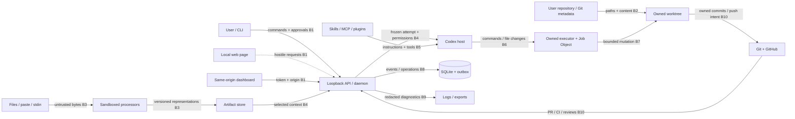

# DARKSTAR MVP threat model

> [Documentation index](../../README.md)

**Status:** Required security contract for DS-010  
**Applies to:** Windows-first local daemon, CLI, dashboard, artifact processors, Codex host, owned worktrees, and GitHub delivery  
**Review gate:** DS-200 before dogfood/release

## 1. Security objective

DARKSTAR runs an autonomous coding provider against user repositories and
untrusted evidence. The MVP must preserve user intent, repository/data integrity,
secret confidentiality, least privilege, auditable control flow, and exactly-once
ownership of external side effects. It must make uncertainty visible instead of
silently widening authority or guessing success.

The primary safety invariants are:

1. artifact/repository/provider text is data, not authorization;
2. no workflow, provider, tool, or UI action broadens another approval class;
3. every filesystem, command, network, tool, Git, push, and PR effect has a scoped
   owner, policy decision, durable intent, and evidence;
4. original user work and evidence are never silently discarded;
5. secrets are withheld/redacted by default and never placed in logs or provider
   context merely because DARKSTAR can read them;
6. process termination targets an owned Job Object, not a name or unverified PID;
7. ambiguous side effects reconcile before retry/fallback; and
8. a high-risk boundary cannot ship without an assigned control story and owner.

## 2. Scope, assets, and adversaries

### Assets

- user repositories, dirty changes, branches, commits, remotes, and credentials;
- artifacts, extracted representations, prompts, approval decisions, and feedback;
- daemon database/event log, endpoint token, configuration, and operation records;
- provider, GitHub, MCP, plugin, and local process credentials;
- provider context, tool arguments/output, logs, exports, and crash diagnostics;
- workflow definitions, capability manifests, policy, and trusted binaries; and
- external GitHub branches, pull requests, comments, reviews, and CI state.

### Adversaries and failure sources

- a malicious or compromised repository, dependency, build script, or Git hook;
- hostile evidence containing prompt injection, parser exploits, bombs, or secrets;
- a malicious local webpage or other same-user process calling the loopback API;
- a compromised/misconfigured skill, MCP server, plugin, provider tool, or CLI;
- malicious filenames, symlinks, junctions, remotes, environment variables, or
  executable shims;
- network attackers against provider/delivery connections;
- accidental user/operator error and stale approvals;
- crashes, retries, timeouts, partial writes, antivirus locks, and PID reuse; and
- a model following adversarial content or proposing an unsafe command.

The Windows user account and OS kernel are trusted to enforce process/file ACLs.
A fully compromised same-user account can read process memory and is outside the
MVP confidentiality claim, but DARKSTAR still authenticates loopback mutations,
uses restrictive files, minimizes credentials, and audits actions. Provider and
GitHub services are trusted to enforce their credentials, not to supply DARKSTAR
workflow truth. Multi-user/system-service mode, remote daemon access, untrusted
workflow installation, automatic deployment, and arbitrary plugin installation
are outside MVP scope.

## 3. Trust-boundary diagram

Dashed input is expected hostile traffic. Every arrow crossing into daemon-owned
state is authenticated/validated and every outbound side effect is policy-gated.

## 4. High-risk boundary register

Risk is qualitative for M0: `critical` permits direct code execution, secret loss,
or destructive/duplicate external mutation; `high` permits authority confusion,
persistent integrity loss, or material denial of service. Controls marked by DS
number are existing backlog commitments. “Owner” names the accountable subsystem
role; the Darkstar team owns delivery until a named assignee is recorded.

| Boundary | Principal threats | Risk | Required backlog controls | Accountable owner |
|---|---|---|---|---|
| B1 Local client → loopback API | token theft, hostile origin/CSRF, replay, cross-user state mutation | critical | DS-034, DS-191, DS-199, DS-200 | Runtime/API security owner |
| B2 Repository/path → workspace | traversal, symlink/junction escape, broad-root access, malicious Git config/hooks | critical | DS-112, DS-190, DS-195, DS-200 | Workspace/Git security owner |
| B3 Artifact bytes → processor/store | parser exploit, decompression/size bomb, MIME confusion, active content, prompt injection | critical | DS-025, DS-075, DS-080, DS-193, DS-199 | Artifact security owner |
| B4 Artifact/context → provider | injection treated as instruction, secret disclosure, stale/late evidence, context substitution | critical | DS-077, DS-078, DS-098, DS-193, DS-199 | Context/provider security owner |
| B5 Skill/MCP/plugin → Codex | inherited tool escalation, malicious instructions/scripts, namespace shadowing, credential misuse | critical | DS-098, DS-130, DS-132, DS-192, DS-193 | Capability security owner |
| B6 Provider → command/process | shell injection, unsafe executable discovery, environment/working-dir escape, orphan child tree | critical | DS-097, DS-114, DS-192, DS-194, DS-200 | Executor/platform security owner |
| B7 Executor → owned worktree/Git | destructive commands, dirty-state loss, unowned ref mutation, hook execution | critical | DS-112, DS-118, DS-190, DS-195, DS-200 | Workspace/Git security owner |
| B8 Commands/events → SQLite/outbox | replay/confused idempotency, tampering, partial commit, duplicate effect after crash | high | DS-031, DS-032, DS-037, DS-038, DS-194 | Runtime/recovery owner |
| B9 Runtime evidence → logs/export | credentials/raw sensitive artifacts in logs, fixtures, errors, or support bundles | critical | DS-040, DS-071, DS-193, DS-200 | Data-protection owner |
| B10 Worktree/daemon → GitHub | credential exposure, wrong remote/base/head, force push, duplicate PR/comment, unapproved publication | critical | DS-150, DS-151, DS-152, DS-153, DS-157, DS-194 | Delivery security owner |
| B11 Approval actor → workflow/provider/delivery | cross-class approval, stale scope/policy, unauthorized actor, replay | critical | DS-005, DS-058, DS-096, DS-116, DS-192 | Authorization owner |
| B12 Installed binary/config → daemon | malicious executable/shim/update, config secret leak, protocol drift | high | DS-022, DS-030, DS-091, DS-099, DS-200, DS-210 | Release/platform owner |

The machine-readable
[`threat-negative-tests.json`](../../../examples/security/threat-negative-tests.json)
duplicates these mappings so CI fails if a high-risk boundary lacks an owner,
control story, or negative test.

## 5. Threat analysis and required behavior

### Local API abuse

The API binds loopback only and requires the DS-009 256-bit token on every
non-health request. State/token files are user-only, tokens never enter URLs,
logs, browser storage readable by arbitrary origins, or process command lines.
Dashboard mutation requires same-origin validation; reject null/hostile Origin,
credentialed cross-origin requests, unexpected Host, and content types that allow
form-based CSRF. Rotate token on daemon restart and after suspected disclosure.
Rate/size/depth limits apply before expensive parsing. All mutations remain
idempotent and revision-checked even after authentication.

### Prompt injection and malicious repositories/files

Repository and artifact content is untrusted evidence. System/orchestrator
instructions are structurally separated from labeled evidence; content cannot
approve checkpoints, alter policy, install tools, broaden roots, or authorize
network/commands. The provider may recommend an action only. DARKSTAR independently
validates typed outputs and all effects.

Processors run out of process with no network and strict byte/page/pixel/cell/time/
memory/output limits. Original bytes and diagnostics survive extraction failure.
Archives, executables, active content, unsupported formats, malformed encodings,
polyglots, and MIME mismatches are quarantined or descriptor-only. No preview or
log renders active content unsafely.

### Paths and workspace isolation

Every path is resolved from a trusted root using Windows canonical identities and
revalidated at open/mutation time. Reject absolute paths where relative paths are
required, `..`, ADS/device paths, UNC/network roots unless explicitly supported,
case/normalization ambiguity, and symlink/junction/reparse escapes. Never perform
recursive destructive operations on an unresolved root or user checkout. Owned
worktrees, refs, and branches require durable ownership evidence; dirty/unknown
state enters reconciliation.

Git runs with explicit arguments, cwd, environment, config isolation, and hooks
disabled for DARKSTAR-owned operations where supported. Repository-controlled
aliases, credential helpers, diff/merge filters, pagers, and hooks are not trusted
command sources. No automatic clean/reset/stash/rebase/force-push.

### Commands, provider tools, and capabilities

Default execution uses argument arrays, exact canonical executables, explicit cwd,
allowlisted environment, output/time limits, and no shell interpolation. A shell
is a separately named high-risk capability requiring policy and approval. Provider
command/file/network/tool approvals cannot satisfy workflow or delivery approval.

Skills and tool descriptions are untrusted guidance. Required capabilities must be
guaranteed or explicitly registered and fingerprinted per DS-007; inherited Codex
capabilities are denied by default. A dependency declaration cannot install or
authorize a tool. Tool calls use normalized capability identities, scoped argument
digests, DS-005 permission decisions, and result evidence. Ambiguous/side-effecting
failure never triggers a different tool automatically.

Child processes are assigned before execution to a kill-on-close Job Object. Stop,
timeout, daemon crash, and second-signal escalation target only the owned job and
leave the attempt uncertain until DS-003 reconciliation.

### Secrets and sensitive data

Secrets are credential-store references or injected environment values, never
ordinary configuration/event fields. Logs/events/errors/fixtures/export default to
allowlisted safe fields and structural redaction. Redaction includes values and
common encodings but is not the only control: sensitive artifacts/representations
are withheld from provider context unless policy explicitly authorizes exact
versions. Tool arguments/output are stored as digests/redacted summaries plus a
controlled evidence locator. Revocation stops future use and invalidates health.

### GitHub and external side effects

Health resolves exact repository, authenticated principal, upstream/push remotes,
base/head refs, and permissions without mutation. Push is fast-forward only from
the recorded owned tip. PR creation requires exact head/base, ownership marker,
accepted artifacts, final validation, and external-delivery approval when policy
requires it. Every push/PR/comment/update has a durable operation ID and is
reconciled against remote state after timeout/crash. Names and titles are never
ownership proof; no force push, branch deletion, PR closure/merge, review, or
deployment is implied by a coding attempt.

## 6. Prioritized control inventory

### P0 — must block dogfood

| Control | Owner | Verification |
|---|---|---|
| Canonical path/reparse/workspace enforcement (DS-190) | Workspace/Git security | traversal, junction, ADS/device, broad-root, dirty-worktree negatives |
| Authenticated same-user/same-origin API (DS-191) | Runtime/API security | hostile origin, missing/stale token, Host/CSRF/replay tests |
| Node/provider least-privilege policy (DS-192) | Authorization + capability security | cross-class approvals, inherited tools, shell/network/root expansion denied |
| Secret/sensitive artifact controls (DS-193) | Data protection | seeded credentials absent from prompt/log/event/export; exact disclosure audit |
| Deterministic command executor (DS-114) | Executor/platform security | metacharacters remain arguments, exact executable/cwd/env, timeout tree cleanup |
| Safe artifact processing (DS-080) | Artifact security | bomb/polyglot/malformed/active-content corpus under resource limits |
| Owned Git/delivery mutations (DS-112/118/152/153) | Workspace + delivery security | no dirty-state loss, force push, wrong remote, duplicate push/PR |
| Crash/side-effect reconciliation (DS-194) | Runtime/recovery | fault injection before/after each commit point with zero duplicate effects |
| Pre-dogfood security/data-loss review (DS-200) | Security review owner | no unresolved critical/high command, secret, path, duplicate-effect, data-loss issue |

### P1 — defense in depth before release

- signed/checksummed reproducible Windows build and exact executable health
  (DS-022, DS-099, DS-210; release/platform owner);
- encrypted/OS-protected credential references and rotation guidance
  (DS-030, DS-099, DS-151; data-protection owner);
- bounded/redacted support export and repair diagnostics
  (DS-040, DS-197; runtime/data-protection owner);
- rate/resource/performance budgets including hostile workloads
  (DS-198; performance owner); and
- automated MVP negative scenarios in CI (DS-199; quality/security owner).

## 7. Negative-test inventory

The inventory is executable metadata rather than implementations of future
stories. Each test declares boundary, threat topic, control story, expected
fail-closed result, and evidence. Minimum suites are:

- API: missing/stale/stolen token, hostile Origin/Host, form CSRF, oversized JSON,
  duplicate idempotency payload, and unauthenticated SSE;
- artifacts: injection text, MIME/polyglot mismatch, encrypted/malformed PDF,
  decompression/image/CSV bombs, active HTML/SVG, parser hang/crash, and secrets;
- paths/repos: traversal, absolute/device/UNC/ADS paths, case/Unicode tricks,
  symlink/junction race, dirty user checkout, malicious hooks/config, unowned refs;
- commands/processes: metacharacter arguments, shell request, executable shim,
  env-secret exfiltration, cwd escape, timeout, Ctrl-C, daemon crash, descendant;
- capabilities/approvals: namespace collision, inherited tool, changed fingerprint,
  dependency auto-install, cross-class/stale/replayed approval, denied fallback;
- GitHub: wrong remote/base/head, auth failure, unowned existing branch/PR, rejected
  push, timeout before/after commit, duplicate operation, and force-push request; and
- data: credentials in prompts/events/logs/errors/exports, redaction encodings,
  sensitive artifact disclosure, and revoked credential reuse.

Tests that cannot prove safety must fail the build or mark the capability
unsupported. A test must assert both prevented effect and retained audit/evidence;
an error message alone is insufficient.

## 8. Residual risks and review cadence

Prompt injection cannot be perfectly detected; containment relies on independent
authorization, structured context, least privilege, and effect validation. Secret
redaction is imperfect; minimize collection and withhold by policy. Parser and
provider vulnerabilities remain possible despite sandbox/limits. Same-user OS
compromise can bypass local confidentiality. GitHub/provider service compromise
and account-level overprivilege are external residual risks.

Any change to supported artifact types, provider permissions, capability classes,
remote API exposure, Git/delivery behavior, credential storage, service/multi-user
mode, plugins, or auto-update reopens this model. DS-026 records accepted risk and
supersession; DS-200 is the release gate. Security incidents and failed negative
tests update this register and create owned control stories before capability is
re-enabled.
