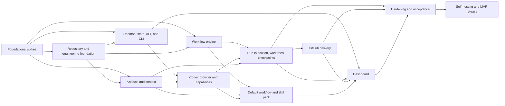

# DARKSTAR MVP Backlog

> [Documentation index](../README.md)

**Status:** Synchronized with the Linear `DARKSTAR MVP` project; Linear owns live status and relationships, while this file preserves the portable planning baseline
**Source specifications:** [Product specification](../product/product-specification.md) and [default workflow](../product/default-workflow.md)  
**Scope boundary:** Windows-first, Codex-first, local daemon, complete CLI, thin dashboard, configurable workflow, folder artifact store, GitHub pull-request delivery, and self-hosting proof

---

## 1. How to use this backlog

Each `DS-###` identifier is a stable planning key. When reconciling this baseline with Linear:

1. Keep one `DARKSTAR MVP` Linear project with the milestones in section 3.
2. Map each initiative in section 5 to the issue's workstream text and labels rather than a separate project.
3. Preserve `DS-###` in every issue title and planning-metadata section after Linear assigns its `DAR-###` identifier.
4. Keep blocked-by relationships aligned with the `Depends on` column; use related links for later issues that extend a deliberately narrow foundation.
5. Keep milestone exit conditions outcome-based. A milestone is not complete merely because its original issue list reached `Done`.
6. Convert unusually large `L` issues into Linear sub-issues during iteration planning without changing their acceptance boundary.

Scope changes must update both this file and Linear in the same planning change.

### Field conventions

| Field | Meaning |
|---|---|
| **Type** | `Spike` resolves uncertainty; `Feature` delivers user-visible behavior; `Task` builds internal capability; `Test` proves behavior. |
| **Priority** | `P0` blocks the MVP critical path; `P1` is required for MVP; `P2` is required polish/hardening that may occur late. |
| **Size** | Relative planning size: `S`, `M`, or `L`. These are not calendar estimates. |
| **Depends on** | Issues that must be complete before this issue can be considered complete. Discovery may begin earlier. |
| **Done when** | Minimum acceptance boundary for closing the issue. |

### MVP working assumptions

The spikes may change these assumptions. Until then:

- DS-001 selected Codex App Server over stdio as the primary integration and a
  visible, exact-version-gated `codex exec --json` fallback for bounded,
  non-interactive nodes.
- One work item owns one delivery branch and one pull request.
- Implementation points run sequentially on that branch.
- Only one write-capable attempt runs per repository; read-only work may run concurrently.
- Planning artifacts pause for iterative approval by default.
- Implementation points validate individually and at the end, create atomic commits, and do not pause by default.
- The default publishes after integrated validation and creates a final GitHub PR.
- Artifact ingestion stores any file, but MVP interpretation is limited to common text formats, text-bearing PDFs, and common images.
- Workflow nodes after PR creation may use manual/external checkpoints until CI, release, and deployment connectors exist.

If a spike overturns an assumption, update the dependent issues before implementation begins.

---

## 2. Dependency map



### Critical path

The shortest credible self-hosting path is:

```text
DS-001/002/003/004/005/006/008/009
→ DS-020/021/023/024
→ DS-031/032/033/034/037/038/040/041
→ DS-050/052/054/055/057
→ DS-070/071/072/073/077
→ DS-090/091/093/094/095/096/097
→ DS-110/112/113/114/116/117/118/119
→ DS-133/134/135/137
→ DS-150/151/152/153
→ DS-199
→ DS-213/214/217/218
```

The dashboard is required for MVP, but the CLI path should reach end-to-end delivery before dashboard implementation begins in earnest.

---

## 3. Milestones

| Milestone | Exit condition | Primary issues |
|---|---|---|
| **M0 — Contracts de-risked** | All blocking spikes have written decisions, executable probes, and affected backlog updates. | DS-001–DS-010 |
| **M1 — Runtime walking skeleton** | A public CLI command starts a persisted deterministic fake-provider run through the daemon; clients can show/watch it, daemon restart recovers it without duplicate effects, and the completed run can be exported. | DS-020–DS-041 |
| **M2 — Workflow and artifact core** | A versioned custom workflow can ingest evidence, create/revise artifacts, route from a selected node, and resume deterministically with a fake provider. | DS-050–DS-080 |
| **M3 — Real Codex execution** | Codex can execute structured read/write nodes with approvals, resume, cancellation, capabilities, and contract tests on Windows. | DS-090–DS-100 |
| **M4 — Self-hostable CLI MVP** | A real Codex-backed work item produces approved artifacts, an implementation plan, validated atomic commits, and a GitHub PR using only public CLI/API interfaces. Completion makes DARKSTAR usable for internal self-development from the CLI. | DS-110–DS-157 |
| **M5 — Dashboard parity** | Every MVP dashboard action maps to an existing API/CLI transition and supports live board/run/agent/artifact/checkpoint views. | DS-170–DS-179 |
| **M6 — Hardened, released MVP** | DARKSTAR has used its own public workflow to deliver a real change, passed acceptance, security, recovery, and Windows release-candidate gates, and ships as a supportable Windows MVP. | DS-190–DS-218 |

---

## 4. Detailed blocking spikes

These issues should be written up before their dependent implementation closes. A spike is complete only when it produces a decision, evidence, rejected alternatives, and backlog/spec changes—not merely when time expires.

### DS-001 — Prove the Codex host protocol

- **Type/Priority/Size:** Spike / P0 / L
- **Question:** Should the MVP use Codex App Server, `codex exec --json`, or a hybrid?
- **Work:** Build Windows probes for authentication, thread start/resume, structured output, streaming, command/file/network approval, user input, skills, images, cancellation, usage limits, and process interruption.
- **Deliverables:** [Codex adapter contract](../architecture/providers/codex/adapter-contract.md), captured versioned event fixtures, [compatibility policy](../architecture/providers/codex/compatibility-policy.md), and an [architecture recommendation](../decisions/DS-001-codex-host-recommendation.md).
- **Done when:** One approach has passed a full read-only and write-capable attempt on Windows, recovery limitations are documented, and DS-090–DS-100 reflect the decision.

### DS-002 — Formalize workflow execution semantics

- **Type/Priority/Size:** Spike / P0 / L
- **Question:** What is the smallest workflow language that supports flexible entry/exit, optional nodes, bounded repair loops, sub-workflows, and route patches without becoming a general programming language?
- **Work:** Define node contracts, edge evaluation, input binding, joins, terminal behavior, checkpoint interaction, route changes, workflow versioning, and deterministic errors.
- **Deliverables:** [Workflow execution semantics](../architecture/workflow/execution-semantics.md), example schemas, transition tables, and a tiny executable/reference interpreter.
- **Done when:** All default and MVP workflows validate under the proposed semantics and ambiguous cases have deterministic outcomes.

**Spike outcome:** Adopt immutable typed graph snapshots, explicit bindings, data-only predicate trees, first-class deterministic gates over persisted reasoning scores, exclusive-or-explicit-fanout transitions, logical-closure joins, budgeted cycle edges, non-recursive pinned sub-workflows, and route patches limited to predeclared transitions and terminal boundaries. The executable evidence is:

- [Workflow execution semantics](../architecture/workflow/execution-semantics.md);
- [`schemas/workflow-v1alpha1.schema.json`](../../schemas/workflow-v1alpha1.schema.json), [`schemas/workflow-v1alpha2.schema.json`](../../schemas/workflow-v1alpha2.schema.json), and [`schemas/route-patch-v1alpha1.schema.json`](../../schemas/route-patch-v1alpha1.schema.json);
- [`examples/workflows/`](../../examples/workflows/), [`examples/scenarios/`](../../examples/scenarios/), and [`examples/route-patches/`](../../examples/route-patches/);
- [`scripts/workflow-reference.mjs`](../../scripts/workflow-reference.mjs); and
- [`tests/workflow-reference.test.mjs`](../../tests/workflow-reference.test.mjs).

### DS-003 — Define crash recovery and idempotency

- **Type/Priority/Size:** Spike / P0 / L
- **Depends on:** DS-001, DS-002, DS-004
- **Question:** How does DARKSTAR recover without duplicating provider work, commits, pushes, artifacts, or PRs?
- **Work:** Create the interruption matrix for every boundary from attempt creation through PR publication; define leases, process identity, reconciliation, idempotency keys, and compensating behavior.
- **Deliverables:** `RECOVERY_MODEL.md` and executable failure-injection scenarios.
- **Done when:** Every durable side effect has an owner, commit point, recovery rule, and testable idempotency strategy.

### DS-004 — Choose work hierarchy and Git topology

- **Type/Priority/Size:** Spike / P0 / M
- **Question:** How do work items, stories, tasks, implementation points, branches, worktrees, commits, and PRs map in MVP?
- **Work:** Test the one-work-item/one-branch/one-PR assumption, sequential point commits, revision after push, rejected points, dirty repositories, forks, and existing branches/PRs.
- **Deliverables:** `WORK_AND_GIT_MODEL.md` with default topology and state transitions.
- **Done when:** Every MVP work object has a stable identity and every Git mutation has deterministic ownership and recovery behavior.

### DS-005 — Separate workflow approval from provider permission

- **Type/Priority/Size:** Spike / P0 / M
- **Depends on:** DS-001, DS-002
- **Question:** How do artifact checkpoints, implementation approvals, Codex command/file/network approvals, and external delivery approvals coexist?
- **Work:** Define approval classes, actors, scope, expiration, session grants, offline behavior, denial/cancel behavior, dashboard presentation, and audit records.
- **Deliverables:** [Approval and permission model](../architecture/security/APPROVAL_AND_PERMISSION_MODEL.md), approval transition tables, and executable negative/idempotency scenarios.
- **Done when:** No provider approval can accidentally satisfy a workflow checkpoint or broaden DARKSTAR policy, and every approval has one idempotent API transition.

### DS-006 — Freeze the MVP artifact and context contract

- **Type/Priority/Size:** Spike / P0 / L
- **Depends on:** DS-002
- **Question:** Which artifact types and derived representations can MVP reliably store, inspect, and supply to Codex?
- **Work:** Build a golden corpus; test text, Markdown, JSON/YAML/CSV, PDFs, common images, malformed files, duplicates, late evidence, prompt injection, size limits, and context budgets.
- **Deliverables:** `ARTIFACT_AND_CONTEXT_CONTRACT.md`, support matrix, golden corpus, and context-selection policy.
- **Done when:** The ingest/extract/store/bind/select lifecycle is explicit and unsupported content degrades safely without disappearing.

### DS-007 — Bound skills and tool interoperability

- **Type/Priority/Size:** Spike / P0 / M
- **Depends on:** DS-001
- **Question:** What can DARKSTAR reliably discover, invoke, version, permit, and audit from Codex and project/user environments?
- **Work:** Test Codex skill inputs, instruction sources, MCP/tool availability, namespaces, version visibility, allow/deny policy, required/fallback behavior, and missing capabilities.
- **Deliverables:** `CAPABILITY_REGISTRY_CONTRACT.md`.
- **Done when:** MVP scope distinguishes guaranteed built-ins, explicitly registered capabilities, inherited Codex capabilities, and unsupported automatic discovery.

### DS-008 — Freeze event, API, and persistence boundaries

- **Type/Priority/Size:** Spike / P0 / L
- **Depends on:** DS-002, DS-003
- **Question:** Which events and resources are the stable contract among daemon, CLI, dashboard, recovery, and tests?
- **Work:** Model resource IDs, event envelopes, versioning, transactions, projections, SSE replay, pagination, API compatibility, and CLI exit/error mapping.
- **Deliverables:** `RUNTIME_CONTRACT.md`, initial OpenAPI/JSON Schemas, and SQLite logical model.
- **Done when:** A fake end-to-end run can be represented without UI- or provider-specific state leaking into core resources.

### DS-009 — Prove Windows daemon and process control

- **Type/Priority/Size:** Spike / P0 / M
- **Depends on:** DS-001, DS-003
- **Question:** How will DARKSTAR start, discover, stop, and recover child process trees on supported Windows versions?
- **Work:** Test application-data paths, lock files, port/token state, atomic files, Job Objects or equivalent, Ctrl-C/service shutdown, ConPTY requirements, executable discovery, long paths, and antivirus interference.
- **Deliverables:** `WINDOWS_PLATFORM_CONTRACT.md` and a process-control probe.
- **Done when:** Killing the parent terminates owned children, restart detects stale state, and the platform strategy boundary is implementable without core OS conditionals.

### DS-010 — Produce the MVP threat model

- **Type/Priority/Size:** Spike / P0 / M
- **Depends on:** DS-005, DS-006, DS-009
- **Question:** What must DARKSTAR prevent or make explicit before running an autonomous coding CLI on user repositories and evidence?
- **Work:** Threat-model local API abuse, prompt injection, malicious repositories/files, path traversal, unsafe commands, inherited provider tools, secret disclosure, Git damage, upload/parser abuse, and PR side effects.
- **Deliverables:** `THREAT_MODEL.md`, prioritized controls, and negative test inventory.
- **Done when:** Every high-risk trust boundary maps to a backlog control and an owner.

---

## 5. Initiative and issue catalog

## Initiative A — Engineering foundation

**Goal:** Establish a maintainable Go/React repository and the shared contracts needed by every subsystem.

| ID | Type | P | Size | Title | Depends on | Done when |
|---|---|---:|:---:|---|---|---|
| DS-020 | Task | P0 | M | Initialize the DARKSTAR repository and module boundaries | — | Go daemon/CLI packages, React dashboard package, schema/docs/test directories, license, and contribution commands build from a clean Windows checkout. |
| DS-021 | Task | P0 | M | Define core ports and adapter package rules | DS-001, DS-002, DS-006, DS-009, DS-020 | Core packages expose provider, artifact-store, delivery, content-processor, platform, and executor interfaces without importing concrete adapters. |
| DS-022 | Task | P1 | M | Add Windows CI and reproducible builds | DS-020 | CI runs formatting, static analysis, unit tests, dashboard build, and Windows binary packaging from a pinned toolchain. |
| DS-023 | Task | P0 | M | Add schema generation and compatibility checks | DS-002, DS-008, DS-020 | Workflow, API, event, provider, and artifact schemas are generated/validated and breaking changes fail CI. |
| DS-024 | Task | P0 | M | Build fake provider and deterministic scenario harness | DS-001, DS-008, DS-020 | Tests can script streamed events, tool calls, approvals, failures, delays, malformed output, resume, and cancellation without network access. |
| DS-025 | Task | P1 | M | Create golden repositories and artifact corpus | DS-004, DS-006, DS-020 | Fixtures cover clean/dirty repos, branches, worktrees, text/PDF/images, malformed evidence, duplicates, and injection content. |
| DS-026 | Task | P1 | S | Establish ADR and risk-register conventions | DS-001–DS-010 | Decisions from every spike are discoverable, linked to affected issues, and checked for supersession before implementation. |

**Initiative exit:** A clean checkout produces tested binaries and deterministic fixtures, and concrete packages cannot bypass extension boundaries.

## Initiative B — Daemon, state, local API, and CLI foundation

**Goal:** Deliver the durable local runtime all other behavior uses.

| ID | Type | P | Size | Title | Depends on | Done when |
|---|---|---:|:---:|---|---|---|
| DS-030 | Feature | P0 | M | Implement layered configuration and Windows paths | DS-009, DS-021 | User/project/default settings resolve with source attribution; secrets and operational state use correct Windows application-data paths. |
| DS-031 | Task | P0 | L | Implement SQLite schema and migration runner | DS-008, DS-023 | Fresh and upgraded databases create transactionally, schema versions are recorded, and failed migrations leave a recoverable database. |
| DS-032 | Task | P0 | L | Implement append-only events and current-state projections | DS-008, DS-031 | State transitions atomically append versioned events and update query projections with replay tests. |
| DS-033 | Feature | P0 | L | Implement daemon foreground/start/stop/status lifecycle | DS-009, DS-030, DS-031 | `darkstar daemon` commands handle running, stale, duplicate, graceful-stop, and forced-stop cases on Windows. |
| DS-034 | Feature | P0 | L | Implement authenticated versioned loopback API | DS-008, DS-033 | API binds only to loopback, uses a protected rotating token, negotiates versions, and exposes stable errors. |
| DS-035 | Feature | P1 | M | Implement SSE event replay and log streaming | DS-032, DS-034 | Clients resume from an event cursor, reconnect without loss/duplication, and stream bounded logs by reference. |
| DS-036 | Feature | P0 | L | Build CLI API client and machine-output conventions | DS-034 | Commands autostart/discover the daemon, support `--json`, use stable exit classes, and never duplicate server-side business logic. |
| DS-037 | Task | P0 | L | Implement leases, queue primitives, and repository locks | DS-003, DS-032 | Durable leases/heartbeats prevent duplicate ownership and enforce one write-capable attempt per repository. |
| DS-038 | Feature | P0 | L | Implement startup reconciliation and interrupted-run recovery | DS-003, DS-033, DS-037 | Restart classifies stale attempts/processes and resumes, retries, or pauses them without duplicating completed effects. |
| DS-039 | Feature | P1 | M | Implement doctor and subsystem health reports | DS-001, DS-030, DS-033 | CLI/API report database, daemon, paths, Git, Codex, GitHub, configuration, and provider readiness with actionable codes. |
| DS-040 | Feature | P1 | M | Export redacted self-contained run bundles | DS-032, DS-035 | A run export contains events, snapshots, artifacts/references, command evidence, and logs while excluding secrets by default. |
| DS-041 | Feature | P0 | L | Execute a persisted fake-provider run through the public CLI/API | DS-024, DS-032–DS-038, DS-040 | A CLI-started deterministic fake-provider run persists lifecycle/evidence, is observable through show/watch, survives one daemon restart without duplicate effects, exports successfully, and is proven by an end-to-end test that does not seed SQLite directly. |

**Initiative exit:** A fake-provider run survives daemon restart and is fully controllable and observable through the public CLI/API.

## Initiative C — Workflow engine and routing

**Goal:** Execute versioned, configurable workflow graphs without hard-coded development stages.

| ID | Type | P | Size | Title | Depends on | Done when |
|---|---|---:|:---:|---|---|---|
| DS-050 | Task | P0 | L | Implement workflow v1alpha1 typed schema | DS-002, DS-023 | Schema represents reasoning, deterministic gate, command, approval, conditional, and sub-workflow nodes; scored assessments, inputs, outputs, validators, checkpoints, retries, and terminals are typed. |
| DS-051 | Feature | P0 | M | Implement workflow loading, installation, and immutable snapshots | DS-030, DS-050 | Workflows load from configured scopes, installations create versions, and runs retain the exact selected workflow/config snapshot. |
| DS-052 | Task | P0 | L | Implement static workflow validation | DS-050 | Validation catches missing references, incompatible bindings, unreachable nodes, unsafe cycles, impossible joins, and missing capabilities. |
| DS-053 | Task | P0 | M | Implement deterministic transition-expression evaluator | DS-002, DS-050 | Conditions use a constrained typed language with no arbitrary code execution and deterministic error messages. |
| DS-054 | Task | P0 | L | Implement run, node, and attempt state machines | DS-002, DS-032, DS-050 | Every allowed transition is transactionally enforced; invalid and duplicate transitions are rejected idempotently. |
| DS-055 | Feature | P0 | L | Implement explicit entry, terminal, and route validation | DS-052, DS-054 | `--from`/`--until` produce a connected authorized route, validate inputs, and record excluded nodes without executing them. |
| DS-056 | Feature | P1 | L | Implement semantic route and readiness assessor | DS-055, DS-094, DS-135 | Structured recommendations distinguish information, recommendation, policy gate, and invariant; human choices are recorded before route changes. |
| DS-057 | Task | P0 | L | Implement bounded repair edges and reusable sub-workflows | DS-052, DS-053, DS-054 | Story execution and validation repair loops run with explicit iteration bounds and isolated state. |
| DS-058 | Feature | P0 | L | Implement route-patch proposal and approval | DS-005, DS-054, DS-055 | New uncertainty can propose node insertion/redirection; daemon validates impact and applies only authorized patches. |
| DS-059 | Task | P1 | M | Implement workflow and route CLI commands | DS-036, DS-051, DS-052, DS-055 | Users can list/show/validate/install/graph/preview workflows and inspect the frozen route in human or JSON form. |

**Initiative exit:** The fake provider executes custom, split-design, middle-entry, terminal-only, and bounded-repair workflows without core changes.

## Initiative D — Artifact store, ingestion, lineage, and context

**Goal:** Make supplied and generated evidence durable, safe, selectable, and traceable at any workflow point.

| ID | Type | P | Size | Title | Depends on | Done when |
|---|---|---:|:---:|---|---|---|
| DS-070 | Task | P0 | L | Implement ArtifactStore connector and folder backend | DS-006, DS-021, DS-030 | Arbitrary binary content stores atomically by stable ID/hash in a configurable folder and can be read/listed without workflow path coupling. |
| DS-071 | Task | P0 | L | Implement artifact registry, versions, and provenance | DS-031, DS-070 | Supplied/generated/derived artifacts record immutable versions, origin, producer, hashes, MIME metadata, roles, tags, and sensitivity. |
| DS-072 | Task | P0 | L | Implement artifact dependencies and scoped invalidation | DS-054, DS-071 | Upstream revision marks only affected descendants invalidated/potentially stale and never deletes source or generated work. |
| DS-073 | Feature | P0 | M | Implement artifact bindings | DS-071 | Artifacts bind/unbind versionedly to projects, work, runs, nodes, checkpoints, decisions, stories, and implementation points. |
| DS-074 | Feature | P0 | L | Implement file, paste, and stdin ingestion | DS-006, DS-070, DS-071, DS-073 | CLI/API ingest arbitrary files and pasted notes/transcripts, detect duplicates, preserve originals, and report capability state. |
| DS-075 | Task | P1 | L | Implement deterministic common-format processors | DS-006, DS-074 | Plain text, Markdown, JSON, YAML, CSV, and supported text-bearing PDFs produce versioned extracted representations with failure isolation. |
| DS-076 | Feature | P1 | M | Implement common-image representation and preview metadata | DS-006, DS-074 | PNG/JPEG/WebP and configured formats retain originals, dimensions/thumbnails where safe, and model-usable references. |
| DS-077 | Task | P0 | L | Implement immutable attempt context manifests | DS-006, DS-071, DS-073, DS-075 | Each attempt records selected artifact versions/representations, instructions, schemas, permissions, workspace, capabilities, and size budget. |
| DS-078 | Feature | P1 | L | Implement late-evidence impact assessment | DS-058, DS-072, DS-073, DS-077 | New evidence proposes continue/refresh/revise/insert/invalidate actions and never pretends an active agent saw unsupplied context. |
| DS-079 | Feature | P1 | M | Implement artifact and ingestion CLI/API surface | DS-036, DS-071–DS-078 | Users can ingest, attach, detach, list, show, diff, extract, lint, revise, and inspect representations/impact in JSON or human form. |
| DS-080 | Task | P0 | M | Enforce artifact ingestion safety limits | DS-010, DS-074, DS-075 | Canonical storage, MIME sniffing, size/decompression limits, processor timeouts, sensitivity checks, and unsafe-file tests pass. |

**Initiative exit:** Notes, transcripts, images, documents, and arbitrary files can enter any run point with immutable provenance and scoped context/invalidation behavior.

## Initiative E — Codex provider and capability interoperability

**Goal:** Run real Codex reasoning and implementation attempts through a stable provider adapter on Windows.

| ID | Type | P | Size | Title | Depends on | Done when |
|---|---|---:|:---:|---|---|---|
| DS-090 | Task | P0 | L | Implement provider adapter and normalized event contracts | DS-001, DS-008, DS-021 | Core provider interface covers health, capabilities, attempt start/resume, events, structured results, interaction, cancellation, recovery metadata, and errors without leaking App Server or exec types. |
| DS-091 | Feature | P0 | L | Implement primary Codex App Server stdio client | DS-001, DS-024, DS-090 | Client pins the exact executable, performs initialize and capability checks, correlates bidirectional messages, manages threads/turns, preserves unknown events, sends `thread/unsubscribe` before normal shutdown, and fails closed on required protocol drift. |
| DS-092 | Feature | P1 | M | Implement bounded `codex exec --json` fallback | DS-001, DS-024, DS-090 | Eligible non-interactive nodes stream JSONL, validate schema output, retain session identity, classify exits, and resume after restart; exact-version CLI probes gate use and fallback selection is always recorded. |
| DS-093 | Task | P0 | L | Normalize Codex events and usage into DARKSTAR events | DS-008, DS-091, DS-092 | Agent messages, commands, file changes, plans, tools, errors, turns, usage/rate limits, and unknown provider events preserve order and opaque correlation IDs for audit and UI. |
| DS-094 | Feature | P0 | L | Execute structured read-only and write-capable nodes | DS-077, DS-091, DS-093 | Node prompt/context/schema produces a validated result, correct workspace changes, and explicit evidence under least required sandbox permissions; interactive/write nodes use the primary App Server path. |
| DS-095 | Feature | P0 | L | Persist and resume Codex threads safely | DS-003, DS-038, DS-091 | Recorded thread/session IDs resume after daemon restart; normal App Server release records `thread/unsubscribe`; an active-writer conflict or uncertain write state pauses for reconciliation instead of creating a duplicate attempt. |
| DS-096 | Feature | P0 | L | Bridge App Server approvals and user-input requests | DS-005, DS-058, DS-091 | App Server command/file/network/permission/tool/user requests become distinct DARKSTAR checkpoints and opaque request IDs map back exactly once; nodes requiring this bridge are ineligible for exec fallback. |
| DS-097 | Feature | P0 | M | Implement provider timeout, interruption, and cancellation | DS-009, DS-091 | Cancel/timeout first requests `turn/interrupt`, then terminates only the owned process tree after grace; IDs and partial workspace evidence remain resumable/reconcilable with a deterministic outcome. |
| DS-098 | Feature | P1 | M | Supply images and selected skills to Codex attempts | DS-007, DS-076, DS-091 | App Server context includes model-usable local images and explicit supported skill paths with capability checks, bounded roots, and auditable selection. |
| DS-099 | Feature | P1 | M | Implement Codex auth, version, capability, and usage health | DS-007, DS-039, DS-091 | Doctor resolves and pins one canonical executable, reports exact version/auth/capabilities/usage readiness, detects conflicting installations, and exposes actionable failures without tokens. |
| DS-100 | Test | P0 | L | Build provider conformance and compatibility suite | DS-090–DS-099 | Fake, App Server, and exec adapters pass their declared shared contracts; exact-version fixtures test wire behavior, recovery, and invoked CLI flags because generated schema equality alone is not sufficient. |

**Initiative exit:** A real Codex subscription executes and resumes typed DARKSTAR nodes with visible events, approvals, capabilities, and cancellation.

## Initiative F — Work execution, agents, checkpoints, and Git worktrees

**Goal:** Turn workflow nodes into safe, durable repository work.

| ID | Type | P | Size | Title | Depends on | Done when |
|---|---|---:|:---:|---|---|---|
| DS-110 | Task | P0 | L | Implement project, work item, run, story, point, and attempt aggregates | DS-004, DS-031, DS-050 | Stable IDs and relationships support the chosen hierarchy, route snapshots, source hashes, priorities, and terminal boundaries. |
| DS-111 | Feature | P0 | M | Implement project/work/run CLI and API commands | DS-036, DS-110 | Users can register/list/show projects, create/import/show work, and start/show/watch runs using stable JSON. |
| DS-112 | Feature | P0 | L | Implement Git repository and worktree manager | DS-004, DS-009, DS-030 | Worktree creation, branch naming, dirty-state protection, base revision, ownership, inspection, and non-destructive cleanup work on Windows. |
| DS-113 | Task | P0 | L | Implement node-attempt execution runner | DS-037, DS-054, DS-094, DS-112 | Runner acquires resources, builds context, invokes executor/provider, streams events, validates outputs, and commits state transactionally. |
| DS-114 | Feature | P0 | L | Implement deterministic command and validation executor | DS-010, DS-113 | Argument-array commands run with cwd/env allowlists, timeout/cancel, captured evidence, stable exit classification, and no shell interpolation by default. |
| DS-115 | Task | P1 | M | Implement agent profiles and provider selection | DS-077, DS-090, DS-110 | Profiles declare role, required/preferred capabilities, provider policy, permissions, and limits; scheduler selects only compatible providers. |
| DS-116 | Feature | P0 | L | Implement artifact checkpoint and iterative revision loop | DS-005, DS-072, DS-096, DS-113 | Approve/reject/request-change actions are idempotent; revisions preserve all drafts/feedback and reconcile affected descendants. |
| DS-117 | Feature | P0 | L | Implement typed implementation-point execution | DS-057, DS-110, DS-113 | Plans produce ordered/dependency-linked points with completion contracts, scoped context, and configurable point-level approval. |
| DS-118 | Feature | P0 | L | Implement point validation and atomic commit policy | DS-004, DS-114, DS-117 | Successful points validate as configured and create one owned atomic commit; failed/rejected points never publish as successful. |
| DS-119 | Feature | P0 | L | Implement pause, resume, retry, continue, and cancel controls | DS-038, DS-113, DS-116, DS-117 | Run controls work from CLI/API in every legal state, reject illegal transitions, and preserve resumability. |
| DS-120 | Feature | P1 | M | Implement agent status and attempt log APIs/CLI | DS-035, DS-093, DS-113, DS-119 | Users can list queued/running agents, inspect provider/workspace/permissions, follow logs, and cancel attempts. |

**Initiative exit:** An approved plan executes in a worktree as validated, atomic, observable implementation points and can recover or accept revisions without losing history.

## Initiative G — Default workflow, readiness, and skills

**Goal:** Ship a useful default inception-to-shipping workflow plus the common capabilities needed to execute its MVP subset.

| ID | Type | P | Size | Title | Depends on | Done when |
|---|---|---:|:---:|---|---|---|
| DS-130 | Task | P0 | L | Implement namespaced capability registry and resolver | DS-007, DS-031, DS-090 | Required/preferred/fallback capabilities resolve without silent shadowing and record source/version/permissions in attempt manifests. |
| DS-131 | Task | P0 | L | Package MVP built-in DARKSTAR skill set | DS-002, DS-130 | Versioned skills exist for route/readiness, questions, research, technical design, story decomposition, tracer bullets, change inspection, reconciliation, and PR authoring. |
| DS-132 | Feature | P1 | M | Inherit eligible Codex/project/user capabilities | DS-099, DS-130 | Explicit allow/deny policy exposes supported registered/inherited capabilities; missing or unversioned capabilities report honestly and use declared fallbacks. |
| DS-133 | Feature | P0 | L | Encode and install the default software-delivery workflow | DS-050, DS-052, DS-057 | Product-level P0–P17 and story S0–S6 contracts validate; optional nodes, terminals, and manual external post-PR nodes are represented. |
| DS-134 | Task | P0 | L | Create default planning artifact templates and schemas | DS-131, DS-133 | Product brief, POC findings, PRD, experience, research, technical design, delivery/story plan, story design/research, and implementation plan are typed and lintable. |
| DS-135 | Task | P0 | L | Define required/recommended inputs and readiness rubrics | DS-006, DS-133, DS-134 | Every default node distinguishes required input, recommended evidence, policy gates, invariants, and targeted upstream remedies. |
| DS-136 | Feature | P1 | M | Implement default entry profiles and route presets | DS-055, DS-133, DS-135 | Idea-to-production, POC, PRD-only, design-only, accepted-story, implementation-only, bug, validation, PR, and release profiles preview correctly. |
| DS-137 | Feature | P0 | L | Implement default story-execution sub-workflow | DS-057, DS-117, DS-133–DS-135 | Clarification, focused research/design, approved implementation plan, point loop, and story validation run independently or under an initiative. |
| DS-138 | Feature | P1 | M | Implement manual/external review, CI, release, and verification nodes | DS-057, DS-116, DS-133 | Post-PR stages can wait for structured human/external evidence without requiring unavailable deployment connectors. |
| DS-139 | Test | P0 | L | Test default workflow routes and applicability | DS-024, DS-056, DS-133–DS-138 | Full route and every default entry profile validate; conditional POC/UX/research nodes activate only when selected or recommended. |

**Initiative exit:** Users receive a high-quality but non-mandatory default workflow and can combine built-in and permitted environment capabilities deterministically.

## Initiative H — GitHub pull-request delivery

**Goal:** Publish the validated work item safely and idempotently to one GitHub pull request.

| ID | Type | P | Size | Title | Depends on | Done when |
|---|---|---:|:---:|---|---|---|
| DS-150 | Task | P0 | M | Implement delivery connector contract and GitHub CLI adapter | DS-004, DS-021 | Core delivery operations use stable connector requests/results and GitHub-specific behavior stays out of workflow/runtime packages. |
| DS-151 | Feature | P0 | M | Implement GitHub authentication and repository health | DS-039, DS-150 | Doctor resolves remote/repository/base branch/auth/push permission and reports actionable failures without mutating the repo. |
| DS-152 | Feature | P0 | L | Implement idempotent branch publication | DS-003, DS-112, DS-118, DS-150 | Push timing honors policy, retries identify already-published commits, unsafe force push is prohibited, and branch ownership is recorded. |
| DS-153 | Feature | P0 | L | Create the default final pull request | DS-131, DS-151, DS-152 | After final validation, DARKSTAR creates exactly one non-draft PR with artifact links, point checklist, commits, risk/rollback, and evidence. |
| DS-154 | Feature | P1 | L | Support early draft PR and incremental updates | DS-118, DS-153 | Configured draft is created once, each successful point updates the same branch/checklist, and final validation can mark it ready. |
| DS-155 | Feature | P1 | M | Update PR summaries and validation evidence idempotently | DS-120, DS-153 | Revisions update owned PR content without duplicating comments/sections or overwriting unrelated human edits. |
| DS-156 | Feature | P1 | M | Implement external review and CI checkpoint observation | DS-116, DS-138, DS-153 | Required status/review state can be recorded or polled and routes targeted repair without untracked patch loops. |
| DS-157 | Test | P0 | L | Build GitHub delivery contract and failure tests | DS-150–DS-156 | Tests cover missing auth, forks/remotes, existing branch/PR, retry after success, push rejection, draft/final, and CI failure using safe fixtures/mocks. |

**Initiative exit:** A validated work item produces one auditable PR under final or incremental-draft policy without duplicate external effects.

## Initiative I — Local dashboard

**Goal:** Provide Kanban-based human control with strict CLI/API parity.

| ID | Type | P | Size | Title | Depends on | Done when |
|---|---|---:|:---:|---|---|---|
| DS-170 | Task | P1 | M | Build React application shell and embed static assets | DS-022, DS-034 | Daemon serves a same-origin dashboard with routing, error boundaries, generated API client, and production asset embedding. |
| DS-171 | Task | P1 | M | Implement dashboard event/reconnect state layer | DS-035, DS-170 | UI hydrates from API, applies ordered SSE events, reconnects from cursors, and never invents state transitions locally. |
| DS-172 | Feature | P1 | L | Implement lifecycle Kanban board and work creation | DS-111, DS-171 | Board filters/projects/cards update live; creating a work item and legal card actions call the same API operations as CLI. |
| DS-173 | Feature | P1 | L | Implement run detail, route, node, and attempt timeline | DS-059, DS-120, DS-171 | Users inspect requested/selected route, node states, attempts, commands, validation, commits, and terminal boundary. |
| DS-174 | Feature | P1 | M | Implement route preview, readiness, and redirection UI | DS-056, DS-058, DS-171 | UI distinguishes advice levels, shows impact, and records continue/add/supply/cancel choices without silent rerouting. |
| DS-175 | Feature | P1 | L | Implement checkpoint, input, and artifact revision UI | DS-116, DS-171 | Users approve/reject/request changes/answer; revision rounds and affected lineage are visible and actionable. |
| DS-176 | Feature | P1 | M | Implement active agents, permissions, logs, and cancellation UI | DS-096, DS-119, DS-120, DS-171 | Active/queued attempts show provider, elapsed time, workspace, requested permissions, live logs, and legal cancellation. |
| DS-177 | Feature | P1 | L | Implement evidence ingestion and artifact experience | DS-079, DS-171 | Drag/drop/paste targets work/run/node/checkpoint/story/point; previews, provenance, representations, extraction, and impact approval are visible. |
| DS-178 | Feature | P1 | M | Implement provider, project, and daemon health/settings UI | DS-030, DS-039, DS-099, DS-171 | Users inspect effective config and health and invoke only API-backed safe configuration actions. |
| DS-179 | Test | P1 | L | Complete accessibility and CLI/dashboard parity tests | DS-172–DS-178 | Keyboard/focus/non-color status requirements pass and every mutation maps to a documented CLI/API operation and audit event. |

**Initiative exit:** The dashboard fully controls the MVP without becoming a second orchestration implementation.

## Initiative J — Security, reliability, observability, and acceptance

**Goal:** Prove that the local autonomous runtime protects user state and meets every MVP scenario.

| ID | Type | P | Size | Title | Depends on | Done when |
|---|---|---:|:---:|---|---|---|
| DS-190 | Task | P0 | L | Enforce canonical paths and workspace boundaries | DS-010, DS-030, DS-070, DS-112 | Traversal, symlink/junction escape, broad-root targeting, and unauthorized repository/file access are denied and audited. |
| DS-191 | Task | P0 | M | Harden local API, token, origin, and CSRF controls | DS-010, DS-034, DS-170 | Only authorized same-user/same-origin clients mutate state; token/state files use restrictive permissions and hostile local pages fail. |
| DS-192 | Task | P0 | L | Enforce node/provider permission policy | DS-005, DS-096, DS-114, DS-130 | Attempts receive only declared filesystem/network/command/tool permissions; expansion requires the correct explicit approval. |
| DS-193 | Task | P0 | L | Implement secret redaction and sensitive-artifact disclosure controls | DS-006, DS-010, DS-040, DS-077 | Secrets are excluded/redacted from logs/exports and sensitive artifacts cannot enter provider context without policy authorization. |
| DS-194 | Test | P0 | L | Build crash and side-effect fault-injection suite | DS-003, DS-038, DS-095, DS-118, DS-152, DS-153 | Forced failure at every documented boundary recovers without duplicate artifact, commit, push, PR, or successful node execution. |
| DS-195 | Test | P0 | L | Build Git safety and dirty-worktree regression suite | DS-112, DS-118, DS-152, DS-190 | Existing user changes are never discarded; worktree/branch cleanup is explicit and recoverable. |
| DS-196 | Test | P1 | M | Test leases, concurrency, and provider backoff | DS-037, DS-097, DS-113 | Duplicate workers, expired leases, rate limits, queue fairness, and one-writer-per-repository invariants behave deterministically. |
| DS-197 | Task | P1 | M | Implement database backup, migration recovery, and repair diagnostics | DS-031, DS-033, DS-039 | Upgrades preserve state, failed migration recovery is documented/tested, and doctor detects corruption with non-destructive guidance. |
| DS-198 | Test | P1 | M | Establish local performance and resource budgets | DS-035, DS-074, DS-113, DS-171 | Startup, idle usage, event/log volume, large artifact handling, and dashboard responsiveness meet documented Windows MVP thresholds. |
| DS-199 | Test | P0 | L | Automate MVP acceptance scenarios A–M | DS-100, DS-139, DS-157, DS-179, DS-190–DS-198 | CI exercises single-artifact, self-change, custom flow, revision, explicit entry, invalidation, point policies, recovery, parity, provider, evidence, and capability scenarios. |
| DS-200 | Task | P0 | M | Complete pre-dogfood security and data-loss review | DS-190–DS-199 | No unresolved high-severity command-injection, secret-disclosure, path-escape, duplicate-side-effect, or data-loss finding remains. |

**Initiative exit:** All acceptance scenarios are automated, recovery is fault-tested, and no high-severity data-loss/security issue remains.

## Initiative K — Windows packaging, dogfooding, and MVP release

**Goal:** Install DARKSTAR locally, use it to improve itself, and release a supportable Windows MVP.

| ID | Type | P | Size | Title | Depends on | Done when |
|---|---|---:|:---:|---|---|---|
| DS-210 | Feature | P1 | L | Produce installable Windows MVP build | DS-022, DS-033, DS-170, DS-200 | Versioned `darkstar.exe` package installs/runs without development runtimes, locates assets, uses correct state paths, and uninstalls without deleting user projects/artifacts. |
| DS-211 | Task | P1 | M | Write installation, configuration, recovery, and troubleshooting guides | DS-039, DS-210 | A new user can configure Codex/GitHub/project/workflow, recover a stopped run, export diagnostics, and understand limitations. |
| DS-212 | Task | P0 | M | Seed DARKSTAR's own dogfood project and default workflow | DS-133–DS-139, DS-210 | Repository contains accepted config, validation entrypoint, artifact folder, templates, and route profiles usable only through public interfaces. |
| DS-213 | Feature | P0 | M | Use DARKSTAR to create and approve a real DARKSTAR change specification | DS-199, DS-200, DS-212 | Exported run proves middle/full routing, evidence ingestion, artifact revision/approval, and accepted implementation plan for a real feature. |
| DS-214 | Feature | P0 | L | Use DARKSTAR to implement, validate, and open its own PR | DS-213 | Codex executes the approved points, creates validated atomic commits, survives one forced restart, pushes, and opens the audited PR. |
| DS-215 | Task | P0 | L | Repair product gaps found during first dogfood run | DS-214 | Every blocker/critical friction item is fixed through tracked work and all affected acceptance/recovery tests pass. |
| DS-216 | Feature | P1 | L | Dogfood one extension-boundary change | DS-215 | DARKSTAR delivers either a second ArtifactStore/content processor or adapter-facing feature without modifying workflow-core abstractions. |
| DS-217 | Test | P0 | L | Execute Windows release-candidate validation | DS-199, DS-200, DS-210, DS-211, DS-215, DS-216 | Clean-machine install, upgrade/restart, Codex auth, GitHub PR, dashboard/CLI parity, export, and self-host scenarios pass. |
| DS-218 | Task | P0 | M | Publish the DARKSTAR Windows MVP | DS-217 | Versioned artifacts, checksums, release notes, known limitations, support/troubleshooting path, and the self-hosting evidence bundle are published. |

**Initiative exit:** The released Windows build has delivered a real change to itself through the same public workflow users receive.

---

## 6. MVP acceptance-criteria coverage

This matrix prevents an acceptance scenario from becoming “someone else's issue.”

| Spec scenario | Primary owning issues |
|---|---|
| **A — Single-artifact route** | DS-055, DS-116, DS-134, DS-139, DS-199 |
| **B — End-to-end self-change** | DS-117, DS-118, DS-153, DS-213, DS-214 |
| **C — Custom workflow** | DS-050–DS-055, DS-059, DS-139 |
| **D — Split design workflow** | DS-050, DS-052, DS-116, DS-134, DS-139 |
| **E — Iterative artifact review** | DS-072, DS-116, DS-175, DS-199 |
| **F — Explicit entry** | DS-055, DS-111, DS-136, DS-199 |
| **G — Revision invalidation** | DS-072, DS-078, DS-116, DS-199 |
| **H — Implementation-point policy** | DS-117, DS-118, DS-154, DS-199 |
| **I — Crash recovery** | DS-003, DS-038, DS-095, DS-194, DS-214 |
| **J — CLI/dashboard parity** | DS-036, DS-171–DS-179, DS-199 |
| **K — Provider boundary** | DS-090, DS-100, DS-199 |
| **L — Evidence ingestion during a run** | DS-070–DS-080, DS-177, DS-199 |
| **M — Skills and environment tools** | DS-098, DS-130–DS-132, DS-199 |

---

## 7. Suggested first iteration

The first iteration should resolve uncertainty and produce a walking skeleton, not begin the dashboard.

### Start immediately

- DS-001 — Codex host protocol
- DS-002 — Workflow semantics
- DS-004 — Work/Git topology
- DS-006 — Artifact/context contract
- DS-007 — Capabilities contract
- DS-009 — Windows process contract
- DS-020 — Repository initialization
- DS-022 — Windows CI
- DS-024 — Fake-provider harness
- DS-025 — Golden fixtures

### Start as soon as inputs exist

- DS-005 after DS-001 and DS-002
- DS-003 after initial DS-001/002/004 decisions
- DS-008 after DS-002/003 direction stabilizes
- DS-010 after DS-005/006/009
- DS-021 and DS-023 as contracts stabilize

### First demonstrable result

The first demo should be:

```text
darkstar work create "Produce a technical design and stop"
→ fake provider streams events
→ artifact is written to folder storage
→ approval checkpoint appears
→ user requests one revision
→ user approves
→ daemon restarts
→ run remains completed and exportable
```

That walking slice proves the core architecture before real Codex, Git mutation, PR delivery, or dashboard complexity is introduced.

---

## 8. Backlog completion rule

The MVP backlog is complete only when:

- every P0 and P1 issue above is closed or explicitly removed through a recorded product decision;
- all A–M acceptance scenarios pass on the supported Windows environment;
- DARKSTAR completes the self-hosting run in DS-213/DS-214;
- no unresolved high-severity security or data-loss risk remains; and
- the released binary, CLI, dashboard, default workflow, schemas, documentation, and exported self-hosting evidence agree on behavior.
