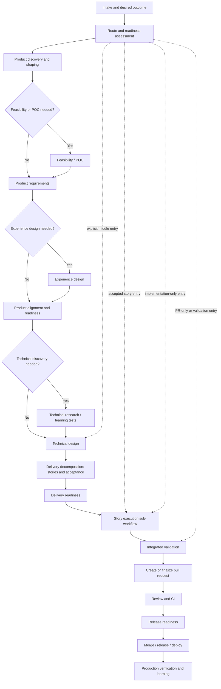
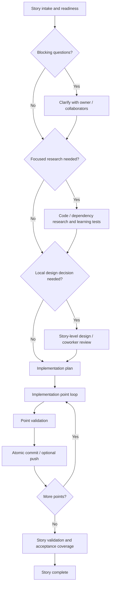

# DARKSTAR Default Software Delivery Workflow

> [Documentation index](../README.md)

**Status:** Normative default-workflow specification  
**Workflow ID:** `darkstar/software-delivery`  
**Purpose:** Provide a strong, enterprise-friendly path from an initial product idea through production verification without making that path mandatory for every work item.

The executable `v1alpha1` encoding is [`software-delivery.json`](../../examples/workflows/software-delivery.json), with the reusable child graph in [`story-execution.json`](../../examples/workflows/story-execution.json). Runtime meaning and deterministic error behavior are defined in the [workflow execution semantics](../architecture/workflow/execution-semantics.md).

---

## 1. Design position

The default workflow is a **reference path and guidance system**, not a required maturity model. It gives DARKSTAR a useful definition of “end to end,” supplies standard artifact contracts, and lets readiness advisors detect missing context. A project can replace it, extend it, remove nodes, change checkpoints, or start and stop anywhere its policies permit.

The workflow is split into two composable graphs:

1. The **product delivery workflow** shapes an idea, establishes product and technical intent, decomposes the work, integrates the results, and moves the change toward production.
2. The **story execution sub-workflow** is invoked for each ready story or independently for a small work item. It handles developer clarification, focused research, local design, implementation planning, implementation points, and validation.

This split is deliberate. Product discovery and release happen once for an initiative; developer discovery and implementation planning may happen once per story. A single linear pipeline would either repeat expensive product work or make story-level work too coarse.

---

## 2. Adjustments to the conventional narrative

The described enterprise process is broadly correct, with five important refinements:

1. **A POC is conditional.** It is appropriate when feasibility, integration behavior, performance, usability, or technical risk is unknown. Making it mandatory would produce throwaway work for routine changes.
2. **Experience design is conditional.** User-facing behavior may need flows, wireframes, content, accessibility states, or a design-system review. Backend, infrastructure, and internal refactors usually do not need screens.
3. **Product and engineering collaboration is continuous.** The default includes explicit readiness gates, but it must not recreate a one-way “product throws a document over the wall to development” handoff.
4. **Research, questions, and design are recursive capabilities.** They appear at sensible default points but may be invoked whenever new uncertainty is discovered. They are not steps that become illegal after completion.
5. **Validation is continuous.** Validation may occur during a POC, at every implementation point, before creating a PR, in PR/CI review, before release, and after deployment. “Validate” is therefore a policy attached to boundaries as well as a workflow node.

For small bugs, documentation changes, well-specified stories, and emergency fixes, most product-level nodes should be skipped. The default is valuable only if it scales down as well as up.

---

## 3. Default workflow at a glance



The dotted edges are examples, not a complete list. Every node marked as an entry point in its contract can be selected explicitly.

---

## 4. Product delivery nodes

### P0 — Intake and desired outcome

**Purpose:** Capture what the human wants DARKSTAR to accomplish without prematurely prescribing a complete route.

**Typical inputs:** Free text, local artifacts, a repository path, a Jira/GitHub reference, existing designs, or an explicit command such as “write a TDD and stop.”

**Outputs:**

- normalized work item;
- desired outcome and terminal boundary;
- source references and attachments;
- constraints and known acceptance criteria;
- requested urgency and risk context; and
- explicit human instructions that subsequent route inference cannot override.

**Default checkpoint:** None. The human already supplied the request.

**Valid terminal:** Yes, while still a draft.

### P1 — Route and readiness assessment

**Purpose:** Recommend the smallest route likely to produce the requested outcome safely.

**Behavior:**

- honors explicit entry and terminal choices first;
- classifies the work as product discovery, POC/spike, artifact-only, feature delivery, bug/hotfix, refactor, operational change, documentation, validation-only, or release-only;
- checks required and recommended inputs for the proposed entry node;
- identifies uncertainty and risk that may justify upstream work;
- proposes optional nodes only when they are likely to change downstream decisions; and
- presents redirection advice without silently changing the human's chosen route.

**Outputs:** `route_proposal`, `readiness_report`, assumptions, risks, and any input requests.

The assessor never directly selects an edge. It records named scores and evidence;
a downstream deterministic gate applies the versioned project thresholds and
records its gate evidence before the route is frozen or redirected.

**Default checkpoint:** None when confidence and policy permit; soft advisory checkpoint when redirection is recommended; hard checkpoint when required input or policy is missing.

**Valid entry/terminal:** Entry yes; terminal yes for assessment-only requests.

### P2 — Product discovery and shaping

**Purpose:** Establish the problem, target users, expected outcome, constraints, and evidence before defining a solution.

**Activities may include:** Stakeholder discussion, current-state analysis, customer evidence, business rules, success metrics, scope alternatives, and early engineering consultation.

**Artifact:** `product_brief.md` containing problem statement, users/stakeholders, desired outcomes, non-goals, constraints, assumptions, risks, success measures, and unresolved decisions.

**Default checkpoint:** Approve with iterative revision.

**Skip when:** The desired outcome and product context are already sufficient, or the work is technical/operational and has no product-discovery requirement.

**Valid entry/terminal:** Both.

### P3 — Feasibility / proof of concept

**Purpose:** Resolve a specific high-impact uncertainty with the smallest useful experiment.

**Activation conditions:** Unknown third-party behavior, unproven architecture, material performance risk, uncertain UX, difficult migration, unfamiliar technology, or an explicit spike request.

**Artifacts:**

- `poc_plan.md` defining the question, method, time box, success/failure criteria, and disposal/production intent;
- optional isolated prototype or learning-test workspace; and
- `poc_findings.md` containing evidence, limitations, and recommendation.

**Default checkpoint:** Approve findings with iterative revision.

**Rules:** The POC must answer a named question. Prototype code is not assumed production-ready and cannot enter the delivery branch without an explicit promotion decision and normal validation.

**Skip when:** No material feasibility uncertainty exists.

**Valid entry/terminal:** Both; a standalone spike ends here by default.

### P4 — Product requirements

**Purpose:** Define what must be true for the product change to be successful while leaving implementation choices to technical design.

**Artifact:** `prd.md` containing objectives, users, use cases, functional requirements, business rules, non-functional expectations, acceptance criteria, analytics/measurement needs, dependencies, scope, non-goals, rollout expectations, and unresolved decisions.

**Default checkpoint:** Approve with iterative revision.

**Readiness guidance:** If the PRD embeds unvalidated technical prescriptions, DARKSTAR flags them as constraints or assumptions for technical review rather than silently treating them as architecture.

**Valid entry/terminal:** Both.

### P5 — Experience design

**Purpose:** Define user-visible behavior when the change has an interface or journey.

**Artifacts/references may include:** User flows, wireframes, screen or component references, interaction states, content, error/empty/loading states, responsive behavior, accessibility requirements, design-system mappings, and research evidence.

**Default checkpoint:** Approve with iterative revision, normally by product/design stakeholders.

**Skip when:** The change has no meaningful user experience surface or accepted designs already exist.

**Valid entry/terminal:** Both.

### P6 — Product alignment and readiness

**Purpose:** Confirm that product, design, and engineering share the intended outcome and that unresolved product questions are visible before deeper technical commitment.

**Inputs:** Product brief, POC findings, PRD, experience artifacts, and recorded decisions that exist on the chosen route.

**Outputs:** `product_readiness_report` with requirement coverage, contradictions, missing decisions, feasibility concerns, and stakeholder approvals.

**Default checkpoint:** Approve. Projects may make this an automated policy gate for low-risk work.

**Behavior:** A failed readiness check recommends a targeted revision route to the affected artifact; it does not restart all discovery.

When readiness findings are produced by a reasoning node, they are committed as a
typed scored assessment before a separate deterministic gate evaluates them.
Adding or changing score dimensions updates versioned gate policy without granting
the reasoning provider control of workflow transitions.

### P7 — Technical discovery

**Purpose:** Gather codebase and external evidence needed to make technical decisions without prematurely coding the feature.

**Activities may include:** Repository mapping, pattern discovery, dependency research, learning tests, data/migration inspection, security/privacy analysis, and operational constraints.

**Artifact:** `technical_research.md` with sourced findings, observed behavior, relevant code locations, constraints, reusable patterns, risks, and open questions.

**Default checkpoint:** Approve with iterative revision.

**Skip when:** The implementation area and relevant behavior are already well understood.

**Valid entry/terminal:** Both.

### P8 — Technical design

**Purpose:** Decide how the requirements integrate with the existing system.

**Artifact:** `technical_design.md` containing architecture, boundaries, interfaces, data flow/model, failure modes, migration/compatibility, security/privacy, observability, test strategy, deployment/rollback considerations, alternatives, and decisions.

The artifact may be a TDD, one or more ADRs, an API specification, or another project-specific format. The node's artifact contract—not its display name—defines sufficiency.

**Default checkpoint:** Approve with iterative revision, including relevant engineering collaborators when configured.

**Readiness guidance:** Small changes may use a compact design or skip the node. Cross-layer, high-risk, data-model, security-sensitive, or externally contracted changes should normally include it.

**Valid entry/terminal:** Both.

### P9 — Delivery decomposition

**Purpose:** Convert accepted product and technical intent into independently understandable units of value and work.

**Artifacts:**

- `delivery_plan.md` describing dependency/order strategy, release slices, integration strategy, and shared validation;
- a typed `story_set` containing story outcomes and acceptance criteria; and
- optional initial `task_set` when decomposition is already clear.

**Rules:**

- Stories express observable value or technical outcomes, not file-by-file instructions.
- Dependencies are explicit.
- Stories should be independently reviewable where practical.
- Subtasks are created only when they improve execution clarity; they are not mandatory ceremony.
- The plan identifies which stories may run concurrently and which require sequencing.

**Default checkpoint:** Approve with iterative revision.

**Valid entry/terminal:** Both. Story-writing-only requests end here.

### P10 — Delivery readiness

**Purpose:** Confirm that stories are implementable, traceable to requirements, and safe to schedule.

**Checks:** Acceptance coverage, unresolved product/technical decisions, dependency ordering, testability, rollout/rollback needs, security and data concerns, story size, and provider/tool capability.

**Output:** `delivery_readiness_report` and a schedulable story graph.

**Default checkpoint:** Approve for multi-story initiatives; automated advisory for a single low-risk story.

### P11 — Story execution

**Purpose:** Execute the story sub-workflow for each ready story, respecting dependencies and configured concurrency.

**Behavior:** A single story can invoke the sub-workflow directly. Multi-story initiatives schedule only dependency-ready stories. Under the [MVP work and Git model](../architecture/work/WORK_AND_GIT_MODEL.md), read-only story work may run concurrently, but all write-capable story points execute sequentially in the work item's one delivery branch and attached worktree.

**Outputs:** Validated story changesets, atomic implementation-point commits, evidence, and story completion records.

**Default checkpoint:** Defined by the story sub-workflow.

### P12 — Integrated validation

**Purpose:** Validate the combined change against product, technical, and repository expectations before final delivery.

**Checks may include:** Build, lint, type checks, unit/integration/end-to-end tests, migrations, compatibility, security, performance, accessibility, convention scan, acceptance-criteria coverage, and regression analysis.

**Artifacts:** `validation_report` and `acceptance_coverage`.

**Default checkpoint:** No human pause when all checks pass under default policy. Failures follow a bounded repair route or pause. Projects may require approval of validation evidence.

### P13 — Pull request creation or finalization

**Purpose:** Publish the reviewed branch and create the primary collaboration object for code review.

**Default behavior:** Create a final, non-draft pull request after integrated validation. The PR contains outcome, scope, implementation points, atomic commits, artifact links, risk/rollback notes, and validation evidence.

**Alternate behavior:** Create a draft when implementation starts and update its branch and checklist after each successful implementation point. The same PR is finalized after integrated validation.

**Default checkpoint:** None before creation. Projects may require approval of the changeset or PR content.

### P14 — Review and CI

**Purpose:** Incorporate human/code-owner review and authoritative repository automation.

**Inputs:** PR review comments, required status checks, policy scans, and merge requirements.

**Behavior:** Review findings may route to a targeted story/implementation point, design revision, or requirement clarification. Upstream changes trigger normal lineage invalidation rather than an untracked patch loop.

**Default checkpoint:** External condition—required reviews and checks pass. Until a repository connector is installed, a human may satisfy the checkpoint by attaching a schema-valid `review_ci` evidence record; the record is evidence, not an assertion invented by the workflow.

### P15 — Release readiness

**Purpose:** Decide whether the validated change is safe and authorized to ship.

**Checks may include:** Release notes, feature flags, migrations, rollout and rollback plan, support/operations readiness, observability, change window, compliance, and environment health.

**Artifact:** A schema-valid `release_readiness` evidence record containing the decision, rollout and rollback plans, checks, and accountable decision maker.

**Default checkpoint:** Approve for production-impacting changes; project policy may automate low-risk deployments.

### P16 — Merge, release, and deploy

**Purpose:** Execute configured delivery actions through connectors without embedding provider-specific release logic in the workflow engine.

**Behavior:** Merge, tag, package, release, deploy, or hand off to an external deployment system. Every action is idempotent, permission-scoped, and recorded.

**Default checkpoint:** External policy. In the MVP, the node waits for a schema-valid `release` evidence record containing the release identity, environment, status, and source references. A human can record evidence from an external system until a release connector is installed.

### P17 — Production verification and learning

**Purpose:** Verify that the desired outcome is present after shipping and capture information that should influence follow-up work.

**Checks may include:** Deployment health, smoke tests, error/latency indicators, feature metrics, customer feedback, and rollback triggers.

**Artifacts:** `production_verification` and optional follow-up work items.

**Default checkpoint:** External evidence. The node waits for a schema-valid `production_verification` record containing observation time, health state, concrete checks, and source references; a human can supply it until an observability connector is installed.

**Valid terminal:** Yes; this is the full delivery terminal.

---

## 5. Story execution sub-workflow



### S0 — Story intake and readiness

Confirms the story outcome, acceptance criteria, dependencies, repository baseline, relevant product/technical artifacts, and permitted terminal boundary. Missing recommended context produces guidance; missing required context blocks only when policy demands it.

### S1 — Clarification

Creates a structured question set for load-bearing unknowns. Questions are routed to the configured human role or external system. Answers become versioned inputs. DARKSTAR never invents answers merely to keep the run moving.

### S2 — Focused developer research

Investigates only uncertainties that can change the implementation plan: relevant code paths, established patterns, dependency behavior, learning tests, operational constraints, and prior decisions. The output is a concise `story_research.md` artifact.

**Default checkpoint:** Approve when the node is activated; configurable to automatic for low-risk work.

### S3 — Story-level design and collaboration

Captures a local decision too small for the initiative-level TDD but important enough not to remain only in an agent's context. It may be a compact design note, an ADR, an annotated diff, or a coworker-review checkpoint.

**Default checkpoint:** Approve when the node is activated.

### S4 — Implementation plan

Produces a typed list of implementation points. Each point declares:

- the narrow end-to-end outcome it proves;
- dependencies and affected areas;
- expected tests or other evidence;
- validation commands/profile;
- commit boundary;
- rollback/recovery considerations; and
- completion criteria.

Tracer bullets are the default decomposition skill for cross-layer work. TDD may add Red → Green → Refactor constraints inside a point. The two practices are compatible but neither is mandatory.

**Default checkpoint:** Approve with iterative revision.

### S5 — Implementation-point loop

For each ready point, DARKSTAR invokes the configured implementer with the accepted inputs, scoped permissions, current worktree, and point completion contract. After deterministic validation, it records the diff and evidence and creates an atomic commit when configured.

**Default checkpoint:** No pause between points. Configurable to approve every point, approve selected risk-tagged points, or approve only the combined story result.

**Default validation:** Each point and the final story.

**Default publishing:** Keep point commits local until final validation, then push and create the PR. Alternate policy creates a draft PR at story/initiative start and pushes each successful point.

### S6 — Story validation and acceptance coverage

Runs story-level validation and maps evidence back to every acceptance criterion. A failure returns to the smallest affected point. A requirement or design contradiction routes to the owning upstream artifact and invokes dependency invalidation.

**Default checkpoint:** None on pass; configurable approval of final story result.

---

## 6. Starting in the middle

Every node contract distinguishes **required inputs** from **recommended evidence**.

- Missing required input creates a hard `input_required` result. A project administrator may define whether a human waiver is possible.
- Missing recommended evidence creates a soft readiness advisory. The human can proceed, supply an artifact, or add the recommended upstream node.
- Low confidence creates an explanation and options, not an automatic route mutation.

For example, a user starting at technical design may receive:

```text
Requested route: Technical Design → stop

Required inputs: satisfied
Recommended evidence missing:
- Product acceptance criteria are incomplete.
- No decision identifies whether rate limits are tenant- or user-scoped.

Recommendation: add a focused Product Clarification node before Technical Design.
Choices: continue as requested, add clarification, attach an existing artifact, or cancel.
```

The human remains the driver. DARKSTAR records the choice, any waiver, and the assumptions the downstream agent must preserve. It does not punish a middle entry by silently recreating the entire upstream workflow.

### 6.1 Readiness advice levels

| Level | Meaning | Default behavior |
|---|---|---|
| **Information** | Context could improve quality but no meaningful risk is identified. | Record and continue. |
| **Recommendation** | One or more upstream activities are likely to change the result. | Ask once; human may continue. |
| **Policy gate** | Project policy requires evidence, approval, or a control. | Pause until satisfied or an authorized waiver is recorded. |
| **Invariant** | The node cannot execute safely or coherently, such as no repository for a write node. | Block; not waivable through ordinary run controls. |

### 6.2 Continuous reassessment

Readiness is evaluated at route creation and when a node discovers materially new uncertainty. Reassessment may recommend:

- inserting a focused clarification, research, POC, or design node;
- revising an upstream artifact;
- splitting an oversized story;
- changing the terminal boundary;
- escalating a decision to a named human role; or
- stopping because the requested outcome is already satisfied.

Suggestions are structured route patches. The daemon validates them, shows their consequences and invalidation scope, and applies them only under the configured human/automatic policy.

---

## 7. Default entry profiles

The same graph supports common shortcuts:

| Profile | Typical route |
|---|---|
| **Idea to production** | P0 → P1 → applicable P2–P17 nodes |
| **POC/spike** | P0 → P1 → P3 → stop |
| **PRD only** | P0/P2 → P4 → stop |
| **Design only** | P1 → P7 if needed → P8 → stop |
| **Story decomposition only** | P4/P8 → P9 → stop |
| **Accepted story** | S0 → applicable S1–S6 nodes → P12/P13 as configured |
| **Implementation from accepted plan** | S5 → S6 → P12 → P13 |
| **Bug/hotfix** | P1 → focused S1/S2/S4 as useful → S5/S6 → P12–P17 |
| **Validation only** | P12 or S6 → stop/report |
| **PR preparation only** | P13 → stop |
| **Release only** | P15 → P16 → P17 |

Profiles are route presets, not separate hard-coded pipelines.

---

## 8. Skills and tools

### 8.1 Definitions

A **skill** is a reusable instruction and quality contract that changes how a reasoning node performs work. A **tool** is an executable capability available to an agent or deterministic node. Skills may require tools, produce artifacts, add validators, or constrain commit/order behavior.

DARKSTAR must support both:

- a provider-neutral set of built-in DARKSTAR skills and tools; and
- skills and tools already configured in the user's selected CLI environment.

### 8.2 Built-in skill set

The default distribution should include at least:

| Skill | Default use |
|---|---|
| `darkstar:route-assessment` | Choose the smallest useful route and explain omissions. |
| `darkstar:readiness` | Evaluate required inputs, recommended evidence, risk, and redirection. |
| `darkstar:question-authoring` | Formulate load-bearing questions without guessing. |
| `darkstar:evidence-triage` | Classify supplied evidence, identify relevance, and recommend bindings without changing originals. |
| `darkstar:evidence-research` | Perform repository/external research with sourced findings. |
| `darkstar:product-discovery` | Create problem/outcome-focused product briefs. |
| `darkstar:prd` | Produce requirements and acceptance criteria without over-prescribing implementation. |
| `darkstar:technical-design` | Produce integration-aware technical designs and decision records. |
| `darkstar:story-decomposition` | Create value-oriented stories, dependencies, and acceptance criteria. |
| `darkstar:tracer-bullets` | Decompose cross-layer implementation into thin evidence-producing points. |
| `darkstar:tdd` | Apply Red → Green → Refactor when behavior can be specified first. |
| `darkstar:learning-tests` | Probe unfamiliar dependencies or black boxes before design commitment. |
| `darkstar:security-review` | Identify security/privacy boundaries and required controls. |
| `darkstar:change-inspection` | Check drift, conventions, regression risk, and acceptance coverage. |
| `darkstar:artifact-reconciliation` | Revise a downstream artifact from an upstream diff without needless rewriting. |
| `darkstar:pull-request-authoring` | Produce a traceable PR description and implementation-point checklist. |
| `darkstar:release-readiness` | Verify rollout, rollback, observability, and operational readiness. |

Skills are activated by workflow declaration, deterministic applicability rules, or a reasoning recommendation subject to project policy. Their activation and version are recorded on the run.

### 8.3 Built-in tools

The core runtime exposes provider-neutral tool capabilities such as:

- artifact ingest/read/write/bind/diff/lint and derived-representation access through configured connectors/processors;
- repository search and bounded file reads;
- Git status/diff/worktree/commit operations;
- deterministic command and validation execution;
- checkpoint and structured question creation;
- route proposal and run-state queries; and
- GitHub branch/PR delivery through the configured connector.

The model never receives a raw “set run state” tool. It submits outputs or proposals; the daemon validates and commits state transitions.

### 8.4 User and provider-environment capabilities

Provider adapters expose a `CapabilityManifest` for the active CLI profile. It may include provider-native skills, plugins, MCP servers, tools, commands, or other extensions the provider officially makes available to that session.

DARKSTAR shall not assume every CLI represents extensions the same way. Each adapter is responsible for:

- discovering capabilities using supported provider mechanisms;
- reporting stable names, descriptions, availability, permissions, and version/hash when possible;
- distinguishing user, project, and provider-installed scope;
- invoking or making capabilities available to the provider session; and
- reporting when a requested capability cannot be guaranteed.

Users can enable environment inheritance per provider profile:

```yaml
providers:
  codex-personal:
    adapter: codex
    inheritEnvironmentCapabilities: true
    capabilities:
      allow:
        - "codex:*"
        - "project:*"
      deny:
        - "*:production-deploy"
```

### 8.5 Skill and tool resolution

Capabilities are namespaced to avoid collisions:

- `darkstar:<name>` — shipped provider-neutral capability;
- `project:<name>` — project-defined capability;
- `user:<name>` — user-defined DARKSTAR capability;
- `codex:<name>` or another provider namespace — capability inherited from that CLI environment.

Resolution order is explicit, not shadow-based:

1. workflow-pinned capability and version;
2. project binding;
3. user binding;
4. provider-environment capability; and
5. built-in fallback when the workflow permits one.

Two capabilities with the same unqualified name are an error until the user or workflow selects a namespace. A required skill/tool that is unavailable blocks the node or selects a declared fallback. A preferred capability may be omitted with an audit event.

Illustrative node declaration:

```yaml
skills:
  required:
    - darkstar:technical-design
  preferred:
    - project:architecture-conventions
    - codex:diagramming
tools:
  required:
    - darkstar:repository-search
    - darkstar:artifact-store
  optional:
    - codex:browser
inheritProviderEnvironment: true
```

### 8.6 Permissions and audit

Capability discovery does not grant permission. The node, provider profile, project policy, and user approval combine to determine what an attempt may use. A skill cannot silently add a production credential, broaden filesystem scope, or bypass a checkpoint.

Each attempt records:

- resolved skill/tool identifiers and versions or hashes;
- source scope and provider profile;
- requested and granted permissions;
- unavailable preferred capabilities;
- capability-related user decisions; and
- enough manifest information to diagnose later behavior.

Native provider extensions may change independently of DARKSTAR. The audit record must therefore identify that exact reproducibility was not possible when a provider cannot expose a version or content hash.

---

## 9. Default checkpoint policy

The conservative default is:

- approve and iteratively revise every activated planning artifact: product brief, POC findings, PRD, experience design, technical research, technical design, delivery plan/story set, story research/design, and implementation plan;
- pause at product and delivery readiness for non-trivial initiatives;
- do not pause between implementation points;
- validate every implementation point and the combined result;
- create atomic commits per successful point;
- push after final integrated validation;
- create a final pull request automatically;
- wait for required PR reviews and CI;
- require release approval for production-impacting changes; and
- verify production automatically where connectors exist.

Projects can override every line. A fast-path workflow may auto-approve all planning nodes, while a regulated workflow may add separate security, data, architecture, QA, or change-management approvals.

---

## 10. Default artifacts and lineage

```text
work_item
├── evidence*
├── product_brief?
├── poc_findings?
├── prd?
│   └── experience_design?
├── technical_research?
├── technical_design?
├── delivery_plan
│   └── story_set
│       └── story
│           ├── evidence*
│           ├── story_research?
│           ├── story_design?
│           ├── implementation_plan
│           ├── implementation_point_results
│           └── story_validation
├── integrated_validation
├── pull_request
├── release_readiness?
└── production_verification?
```

The question mark means optional, not untracked. Every produced artifact has explicit dependencies. Revising an upstream artifact invalidates only descendants whose inputs or decisions are affected. Reconciliation starts at the closest affected node rather than rerunning the entire workflow.

### 10.1 User-supplied evidence is a first-class artifact

Users may ingest evidence at any time, not only during intake. Examples include:

- meeting transcripts and interview transcripts;
- personal or shared notes;
- images, screenshots, diagrams, whiteboards, and design exports;
- audio/video recordings and their transcripts;
- PDFs, office documents, Markdown, and plain text;
- CSV/JSON datasets and reports;
- ticket exports, email or chat exports, logs, and incident records;
- links or snapshots from external systems; and
- existing requirements, designs, plans, tests, or code patches.

These use the same artifact registry, connector, hashing, versioning, permissions, and lineage model as DARKSTAR-generated artifacts. “Attachment” describes a relationship, not a lesser storage class.

Every ingested artifact records:

- immutable original content or a connector-backed source reference;
- MIME type, size, content hash, and ingestion time;
- origin, author/owner when known, and provenance;
- user-declared semantic role and tags;
- sensitivity/classification and access policy;
- extraction/transformation status;
- derived representations and the tool/version that produced each one; and
- bindings to projects, work items, runs, nodes, decisions, or other artifacts.

### 10.2 Ingestion, normalization, and context use

Ingestion and interpretation are separate operations:

1. DARKSTAR stores or references the original without altering it.
2. A compatible deterministic parser extracts text and metadata when available.
3. Optional tools may perform OCR, transcription, thumbnailing, table extraction, or format conversion.
4. A reasoning node may summarize or classify the material only when the workflow needs judgment.
5. Every derived representation points back to the original and is independently versioned.

Any file type can be registered even when DARKSTAR cannot interpret it. The UI and CLI show whether an artifact is `stored`, `extractable`, `extracted`, `model_usable`, `unsupported`, or `failed`. A node that requires visual understanding, transcription, or another capability checks the provider/tool manifest before execution.

Artifacts are not automatically copied into every prompt. The context builder selects only material bound to the current node or selected through an explicit relevance rule, records the selection, respects size and sensitivity policy, and provides links/summaries when full content is unnecessary.

### 10.3 Adding evidence during a run

A user can attach new evidence to:

- the overall work item;
- a particular run or route;
- an upcoming or active node;
- a checkpoint/question response;
- a decision or artifact revision; or
- a specific story or implementation point.

Late evidence triggers a scoped impact assessment. DARKSTAR may recommend continuing, refreshing the current node's context, revising an artifact, inserting a clarification/research node, or invalidating affected descendants. It never restarts the whole workflow merely because a file was added, and it never ignores relevant late evidence silently.

If an active agent cannot safely accept new context, the daemon finishes or pauses the attempt according to policy and starts a new attempt with a new immutable context manifest. The original attempt remains auditable.

---

## 11. MVP mapping

The full default is specified now, but automation is delivered incrementally.

The Windows MVP automates:

- P0/P1 intake, route assessment, and readiness guidance;
- configurable planning artifact nodes using common templates/skills;
- P8 technical design, P9 decomposition, and the story execution sub-workflow;
- artifact review/revision, implementation points, validation, worktrees, atomic commits;
- P12 integrated validation and P13 GitHub pull-request creation; and
- observation/control through CLI and dashboard.

Product-discovery, POC, PRD, experience-design, review/CI, release, deploy, and production-verification nodes can initially operate as reasoning nodes or manual/external checkpoints. Later connectors automate their source systems and delivery actions without changing the workflow's meaning.

The MVP remains self-hosting when it can start from an accepted work item or technical artifact, plan and implement a DARKSTAR feature through Codex CLI, validate it, and create its pull request. It does not need to automate a production deployment to prove the orchestration kernel.

---

## 12. Acceptance criteria for the default workflow

1. A full-route preview shows a valid path from intake to production verification.
2. A user can start at any entry-capable node and select any reachable terminal boundary.
3. Middle entry checks required inputs and offers upstream guidance without automatically overriding the user.
4. POC and experience-design nodes activate only when applicable or explicitly requested.
5. Questions, research, and local design can be inserted after initial routing when new uncertainty is discovered.
6. Every activated planning artifact supports repeated revision and approval.
7. Delivery decomposition produces typed stories with acceptance criteria and dependencies.
8. Each story can perform its own clarification, research, design, implementation planning, point loop, and validation.
9. Implementation-point approval, validation, commit, push, and PR timing policies work independently.
10. The default creates atomic point commits and a final PR after integrated validation.
11. A configured alternate creates one draft PR early and updates it after each successful point.
12. Upstream revision invalidates only affected downstream artifacts and work.
13. Readiness advice distinguishes information, recommendation, policy gate, and invariant.
14. A human override is recorded with its rationale and assumptions.
15. Built-in DARKSTAR skills and eligible Codex/user/project capabilities can be resolved together without name collision or silent permission expansion.
16. Nodes with unavailable required skills/tools block clearly; unavailable preferred capabilities degrade with an audit event.
17. Post-PR nodes work as manual/external checkpoints before dedicated release connectors exist.
18. A user can ingest notes, transcripts, images, documents, datasets, and arbitrary files before or during a run.
19. Originals remain immutable while extracted text, OCR, transcription, summaries, and other derived representations retain provenance.
20. Attaching relevant evidence during a run produces a scoped impact recommendation and invalidates only affected descendants when accepted.
21. Context manifests show exactly which ingested artifacts or derived representations were supplied to each attempt.
