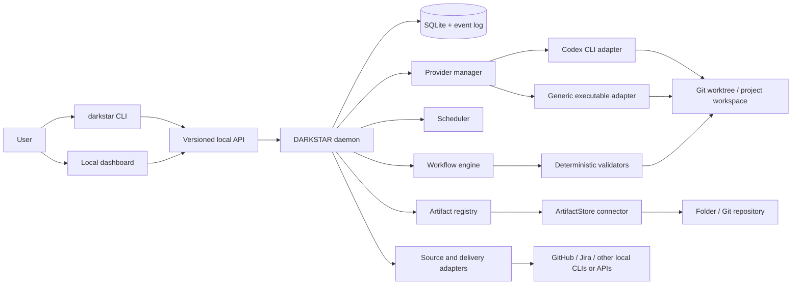
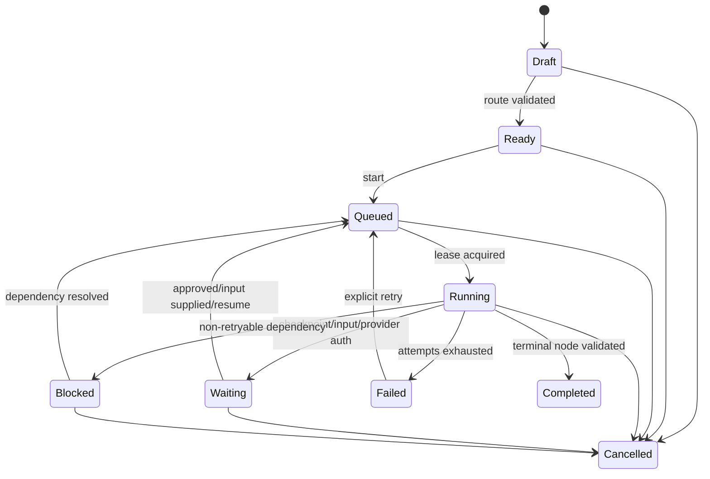

# DARKSTAR

> [Documentation index](../README.md)

## Product and Technical Specification

**Status:** Decision-aligned product specification  
**Name:** DARKSTAR — **D**eterministic **A**utomation **R**untime **K**ernel for **S**oftware **T**asking, **A**ssurance, and **R**ecovery  
**CLI name:** `darkstar`  
**Primary objective:** Build the smallest local, CLI-first software factory that can reliably use itself to implement its next feature.
**MVP implementation backlog:** [MVP backlog](../planning/mvp-backlog.md)

---

## 1. Executive summary

DARKSTAR is a background service that runs on a developer's computer and coordinates work performed by AI coding subscriptions through their installed command-line clients. It turns a work item into a durable, observable run through a user-defined workflow. A workflow may be a full delivery process such as discovery → PRD → functional design → technical design → implementation → validation → pull request, a single activity such as “write a TDD,” or any graph the user defines.

DARKSTAR owns orchestration. AI providers supply reasoning and implementation labor, but they do not decide or remember workflow state. The daemon, CLI, workflow definitions, policies, schemas, validators, and event log do that deterministically.

The product has three surfaces over one local API:

1. A **daemon** owns state, scheduling, execution, recovery, and provider processes.
2. A **CLI** is the complete control surface and the contract used by tests and automation.
3. A **local dashboard** is a thin visual client for the same API, centered on a Kanban board, active agents, artifacts, logs, and approval checkpoints.

The MVP is successful when its own repository can use DARKSTAR to implement a real post-MVP feature: create a work item, infer or select a route, produce and approve artifacts, make a code change through Codex CLI, validate it with deterministic commands, survive a daemon restart, and finish by creating an auditable pull request.

> [!IMPORTANT]
> “Works with any AI subscription service” means any service that provides an authorized local CLI or another user-configured executable interface that DARKSTAR can invoke. DARKSTAR will not automate a provider's consumer website, bypass access controls, translate an API key into a subscription benefit, or promise capabilities the provider's own CLI does not expose.

---

## 2. Product goals

### 2.1 Goals

- Run entirely on the user's machine by default.
- Make every DARKSTAR operation possible through a versioned, scriptable CLI.
- Keep model usage limited to work that needs judgment, synthesis, generation, or semantic classification.
- Make workflow steps, transitions, entry points, exit points, checkpoints, artifacts, validators, and agent assignments configurable.
- Ship a useful default software-delivery workflow from inception through production verification while allowing projects and individual runs to start, stop, skip, insert, or replace any permitted activity.
- Accept work from plain text, local files, and—through adapters—issue trackers such as Jira and GitHub.
- Let a narrowly scoped request start and stop at the relevant workflow node when its input contract is satisfied.
- Let an end-to-end request traverse the configured route and pause only at configured checkpoints, failures, or unresolved decisions.
- Preserve all state outside model context so a run can resume after a crash, reboot, provider failure, or conversation loss.
- Maintain artifact lineage and invalidate downstream work when an upstream dependency changes.
- Support multiple installed AI CLIs without allowing provider-specific behavior into the orchestration core.
- Make runs inspectable and reproducible enough to diagnose why a result occurred.
- Reach self-hosting quickly: use the MVP to build the product after the bootstrap release.

### 2.2 Non-goals for the initial product

- A hosted multi-tenant SaaS control plane.
- Replacing Git, issue trackers, CI systems, or AI subscription clients.
- Making model output bit-for-bit deterministic.
- Allowing an LLM to mutate workflow state directly.
- Guaranteeing unattended operation when a provider requires an interactive login, confirmation, or usage-limit reset.
- A no-code workflow designer in the MVP.
- Enterprise identity, remote teams, billing, quotas, or organizational policy distribution in the MVP.

---

## 3. Design principles

### 3.1 Deterministic shell, probabilistic reasoning

The daemon and CLI perform routing validation, state transitions, locking, retries, configuration resolution, lineage tracking, invalidation, command execution, approvals, scoring-policy evaluation, and scheduling. An LLM is used only for tasks such as route recommendation from ambiguous language, research synthesis, design, planning, code generation, review, and classification that cannot be expressed safely as a fixed rule. LLM assessments are persisted as typed scores and evidence; a versioned deterministic gate—not the LLM response—decides whether and where execution advances.

An LLM may **propose** an action. Only the daemon may **commit** it.

### 3.2 Workflow, not pipeline

A workflow is a versioned directed graph, not a fixed numbered list. Nodes have typed input and output contracts. Edges have deterministic conditions. Graphs may branch, join, loop with an explicit bound, call a sub-workflow, or end at multiple terminal nodes.

### 3.3 Explicit range of work

Every run has a route with an entry node and one or more terminal conditions. The range can be:

- specified explicitly by the user;
- mapped deterministically from a command or work-item type;
- recommended by a reasoning step and confirmed by policy; or
- the workflow's configured default.

DARKSTAR never assumes “continue to production” merely because another node exists.

### 3.4 Durable evidence over conversational memory

Prompts are disposable. Work items, workflow versions, route decisions, artifacts, approvals, tool events, command results, changesets, and provider session references are durable records.

### 3.5 CLI parity

The dashboard contains no orchestration behavior that cannot be invoked through the CLI. A dashboard button calls the same API operation as a CLI command. End-to-end tests exercise the CLI first.

### 3.6 Local-first and least privilege

DARKSTAR uses the user's installed tools and existing authenticated sessions. It binds only to loopback, scopes filesystem access to declared workspaces, exposes permissions before execution, and never silently broadens provider or shell access.

### 3.7 Validate outcomes, not narration

A node completes only when its declared outputs exist and its deterministic validators pass. A provider saying “done” is an event, not proof of completion.

---

## 4. Core concepts

| Concept | Definition |
|---|---|
| **Project** | A source repository plus its DARKSTAR configuration, workflow bindings, validation commands, and integration settings. |
| **Work item** | The user's requested outcome and its source material. It is stable across retries and runs. |
| **Workflow definition** | A versioned graph of typed nodes and transitions. |
| **Workflow version** | An immutable snapshot of a workflow used by one or more runs. Editing a workflow creates a new version. |
| **Node** | One unit of work with inputs, executor, outputs, validators, checkpoint policy, and failure policy. |
| **Route** | The validated subgraph a run is currently authorized to traverse, including its start and terminal boundary. |
| **Run** | One execution of a route for a work item. |
| **Attempt** | One execution attempt of a node. Retries create new attempts rather than overwriting history. |
| **Agent slot** | A schedulable worker allocation backed by a provider profile and workspace. It is not an AI persona. |
| **Provider adapter** | Translation between DARKSTAR's execution contract and a specific installed AI CLI. |
| **Agent profile** | Reusable instructions, provider preferences, permissions, and resource limits for a category of reasoning work. |
| **Artifact** | Typed, versioned content supplied by a user, imported from a source, or generated by a node—for example notes, transcripts, images, requirements, designs, plans, patches, and validation reports. |
| **Artifact binding** | A versioned relationship that makes an artifact relevant to a project, work item, run, node, checkpoint, decision, story, or implementation point. |
| **Checkpoint** | A policy gate that requires approval, acknowledgment, or an automated condition before continuing. |
| **Validator** | A deterministic check applied to inputs, artifacts, repository state, or commands. |
| **Event** | An append-only fact about state or execution used for audit and recovery. |

---

## 5. Primary user experiences

### 5.1 Create only a technical design

User input:

```text
I need to write a TDD for tenant-aware rate limiting. The accepted PRD is docs/rate-limits-prd.md. Stop after the TDD.
```

Expected behavior:

1. DARKSTAR imports the referenced PRD and repository context.
2. Explicit wording sets the route entry and terminal node to `technical_design`.
3. The daemon validates that the node's required inputs are present.
4. The configured technical-design agent creates the artifact.
5. Artifact schema and configured lint checks run.
6. Under the default policy, the artifact enters `awaiting_approval`. The user can approve it or iteratively request revisions until it is acceptable.
7. No implementation node is scheduled. The user can later extend the route with `darkstar run continue`.

If required context is missing, the node becomes `blocked`, lists the missing inputs, and asks only load-bearing questions. It does not silently restart from research.

### 5.2 Deliver a Jira item end to end

User input:

```text
Work Jira item PAY-1427.
```

Expected behavior in the full product:

1. The configured Jira source adapter fetches the item and attachments.
2. The project's entry policy maps an issue request to its default delivery workflow.
3. A route-assessment node recommends which optional nodes add useful information.
4. The daemon validates the recommendation and freezes the route.
5. Agents execute nodes with fresh context packages and isolated attempts.
6. The run pauses at the project's configured design, plan, security, or release checkpoints.
7. Implementation runs in bounded vertical slices when the workflow defines them.
8. Deterministic validation gates completion.
9. The terminal integration node creates or prepares the configured delivery result.

### 5.3 Manage work from the dashboard

The dashboard shows work items as cards grouped by meaningful run state, not by a hard-coded development methodology. Default columns are Backlog, Ready, Running, Waiting, Blocked, Review, Failed, and Done. Users may filter by project, workflow, node, provider, or agent profile.

From a card, the user can:

- inspect its chosen route and current node;
- see which agent/provider is active;
- read streaming output and deterministic command results;
- open or diff artifacts;
- approve, reject, request revision, retry, cancel, pause, or extend the route;
- see why the work is blocked and supply requested input; and
- view cost-like usage data where a provider exposes it, without requiring it for correctness.

### 5.4 Resume after interruption

On restart, the daemon reconstructs run state from durable storage. Attempts left in `starting` or `running` are reconciled against their recorded process/session information. DARKSTAR either reattaches when supported, marks the attempt interrupted and retries according to policy, or pauses for the user. No completed node is rerun merely because the daemon restarted.

### 5.5 Add evidence at any point

A user can drag meeting notes, transcripts, screenshots, diagrams, images, documents, datasets, logs, recordings, or other files onto a work item or active run—or ingest them through the CLI. The user may bind the material to the overall work item or a specific node, checkpoint, story, decision, or implementation point.

DARKSTAR preserves the original, extracts or derives usable representations when supported, and evaluates whether the new evidence affects work already completed or in progress. It recommends the smallest useful response: continue, refresh context, answer a question, revise an artifact, insert a focused node, or invalidate affected descendants. It does not restart the route automatically or inject every attachment into every agent prompt.

---

## 6. Functional requirements

### 6.1 Project and configuration management

The system shall:

- initialize a project from the CLI;
- discover the project from any child directory;
- support system, user, and project configuration with a documented precedence order;
- print the fully resolved configuration and the source of every value;
- validate configuration without starting a run;
- keep secrets out of committed project files;
- snapshot run-affecting configuration at run creation; and
- reject unknown required fields while permitting versioned extension namespaces.

Recommended precedence, highest first:

1. explicit CLI flag;
2. work-item/run override;
3. project configuration;
4. user configuration;
5. shipped default.

Illustrative MVP project configuration:

```yaml
apiVersion: darkstar.local/v1alpha2
kind: Project
metadata:
  name: darkstar
spec:
  provider:
    default: codex-personal
  artifacts:
    connector: folder
    root: .darkstar/artifacts
  checkpoints:
    planningArtifactDefault: approve
  implementation:
    checkpoint: none
    validation: each_and_end
    commit: atomic_per_point
    publish: end
  delivery:
    connector: github
    pullRequest:
      create: final
      draft: false
  platform:
    target: windows
```

The artifact root can point to any folder, including one inside a separate Git repository. Changing the artifact connector or platform strategy must not change workflow definitions.

### 6.2 Workflow definitions

DARKSTAR ships the versioned `darkstar/software-delivery` workflow as its default. It combines a product-level route from intake through production verification with a reusable story-execution sub-workflow. POCs, experience design, developer research, story-level design, and other activities are conditional; readiness guidance can recommend them without overriding an explicit human route. Its normative behavior is defined in the [default workflow specification](default-workflow.md).

The normative `v1alpha1` execution model, normalized schema, stable errors, and executable examples are defined in the [workflow execution semantics](../architecture/workflow/execution-semantics.md). In particular, `terminal: true` means terminal-capable for route selection; it does not require the node to be a graph sink.

Each workflow node shall declare:

- a stable node identifier and display name;
- executor type: `reasoning`, `gate`, `command`, `approval`, or `subworkflow`;
- required and optional inputs;
- typed outputs and artifact templates;
- an agent profile or deterministic command;
- preconditions and validators;
- timeout, retry, cancellation, and concurrency policy;
- checkpoint policy;
- workspace and permission requirements;
- transition conditions; and
- whether the node is a valid entry or terminal node.

Workflow validation shall detect:

- missing node references;
- unreachable nodes;
- illegal or unbounded cycles;
- incompatible input/output bindings;
- joins that cannot be satisfied;
- routes that can schedule work past their selected terminal boundary;
- absent default routes; and
- capability requirements no configured provider can satisfy.

Illustrative workflow:

```yaml
apiVersion: darkstar.local/v1alpha2
kind: Workflow
metadata:
  name: product-delivery
spec:
  entryPolicy:
    default: assess
    allowInferredRange: true
  nodes:
    assess:
      type: reasoning
      agent: route-assessor
      entry: true
      inputs: [work_item]
      outputs:
        route_proposal: schemas/route-proposal.json
      validate:
        - schema: schemas/route-proposal.json
      next:
        - to: clarify
          when: "output.needs_clarification == true"
        - to: prd
          when: "output.start == 'prd'"
        - to: technical_design
          when: "output.start == 'technical_design'"
    clarify:
      type: approval
      outputs:
        answers: schemas/answers.json
      next: [{to: assess}]
      loop:
        maxIterations: 2
    prd:
      type: reasoning
      agent: product-designer
      entry: true
      terminal: true
      inputs: [work_item]
      artifacts:
        - name: prd
          template: templates/prd.md
      checkpoint: approve
      next: [{to: functional_design}]
    functional_design:
      type: reasoning
      agent: functional-designer
      entry: true
      terminal: true
      inputs: [work_item, artifact:prd?]
      artifacts:
        - name: frd
          template: templates/frd.md
      checkpoint: approve
      next: [{to: technical_design}]
    technical_design:
      type: reasoning
      agent: technical-designer
      entry: true
      terminal: true
      inputs: [work_item, repository, artifact:prd?, artifact:frd?]
      artifacts:
        - name: tdd
          template: templates/tdd.md
      validate:
        - command: darkstar artifact lint "${artifact.tdd}"
      checkpoint: approve
      next: [{to: plan}]
    plan:
      type: reasoning
      agent: implementation-planner
      entry: true
      terminal: true
      inputs: [work_item, repository, artifact:tdd]
      artifacts:
        - name: implementation_plan
          template: templates/implementation-plan.md
      checkpoint: approve
      next: [{to: implement}]
    implement:
      type: reasoning
      agent: implementer
      inputs: [work_item, repository, artifact:tdd, artifact:implementation_plan]
      permissions: [workspace.write, process.run]
      implementation:
        pointsFrom: artifact:implementation_plan.implementation_points
        checkpoint: none
        validation: each_and_end
        commit: atomic_per_point
        publish: after_each_point
      outputs:
        changeset: schemas/changeset.json
      next: [{to: validate}]
    validate:
      type: command
      command: ["darkstar-project", "validate", "--json"]
      outputs:
        validation: schemas/validation.json
      next:
        - to: implement
          when: "output.passed == false && run.repairAttempts < 2"
        - to: prepare_change
          when: "output.passed == true"
      loop:
        maxIterations: 3
    prepare_change:
      type: reasoning
      agent: change-author
      terminal: true
      artifacts:
        - name: change_summary
          template: templates/change-summary.md
      checkpoint: none
      delivery:
        pullRequest:
          create: final
          draft: false
```

This compact YAML remains explanatory rather than schema-conforming. The normalized form uses named input bindings and data-only predicate trees instead of string expressions; see the [workflow execution semantics](../architecture/workflow/execution-semantics.md) and [`examples/workflows/`](../../examples/workflows/). Its intent remains: typed nodes, validated edges, explicit bounded loops, flexible entry/terminal nodes, and deterministic transition evaluation.

### 6.3 Route selection

Route selection follows this precedence:

1. `--from`, `--through`, `--until`, or an explicit requested deliverable in structured input;
2. a deterministic project mapping for source/type/label;
3. an optional semantic route assessor;
4. the workflow default.

The route assessor returns structured data, never executable workflow state. The daemon checks that:

- proposed nodes exist;
- the route is connected;
- inputs are available or producible;
- terminal boundaries match user intent;
- required checkpoints remain present; and
- project policy allows any skipped nodes.

If route confidence is below policy or two materially different routes are plausible, the run pauses with a concise choice. Otherwise it proceeds and records the reason. Users may always preview with `--dry-run` and override the route.

### 6.4 Work items and input sufficiency

A work item contains:

- title and requested outcome;
- source and immutable source reference;
- normalized description;
- attachments and linked artifacts;
- project and workflow binding;
- optional explicit entry/terminal nodes;
- constraints, acceptance criteria, and user-supplied context;
- priority and labels; and
- a content hash for change detection.

Entry nodes define an input contract. Starting at `technical_design` is allowed when its required contract is satisfied even if earlier nodes have not run. Optional upstream artifacts improve context but are not fabricated. Missing required inputs create a structured `input_request` that the dashboard and CLI can answer.

### 6.5 Provider adapters

The core provider contract shall cover:

- installation and authentication health checks;
- capability discovery;
- noninteractive and PTY-backed invocation;
- prompt/context delivery;
- working-directory and environment selection;
- structured event parsing where available;
- session resume where available;
- cancellation and timeout;
- exit classification;
- usage reporting where available; and
- redaction of secrets from recorded events.

Provider capability examples include:

```json
{
  "headless": true,
  "streamingEvents": true,
  "sessionResume": true,
  "structuredOutput": false,
  "workspaceWrite": true,
  "shellTools": true,
  "maxParallelSessions": 2
}
```

The core schedules by required capability, not provider name. A node may express preferences and fallbacks, for example:

```yaml
providerPolicy:
  requires: [workspaceWrite, shellTools]
  prefer: [codex-personal, claude-work]
  fallback: any-compatible
```

The MVP includes a first-class **Codex CLI** adapter and a generic executable adapter. A second first-class provider adapter is deliberately an early dogfooded post-MVP feature, proving that the provider boundary is real.

### 6.6 Agent profiles and context packages

An agent profile defines role instructions, eligible providers, required capabilities, permissions, context limits, and output contract. It does not own lifecycle state.

For each attempt, the daemon builds an immutable context manifest containing:

- work-item snapshot;
- workflow and route snapshot;
- node instructions;
- declared input artifacts and their hashes;
- relevant repository facts or selected files;
- output schema and artifact paths;
- permissions and prohibited actions;
- validator commands; and
- a unique attempt identifier.

The provider receives the minimum context needed for the node. Fresh attempts do not depend on hidden conversational context. If the provider supports resuming, resume identifiers are stored as optional optimization data, not the source of truth.

#### Skills and tool capability registry

DARKSTAR supplies provider-neutral built-in skills and tools for route/readiness assessment, questions, evidence research, product requirements, technical design, story decomposition, tracer bullets, TDD, learning tests, security review, change inspection, artifact reconciliation, PR authoring, and release readiness. Workflows declare required or preferred skills/tools by namespaced identifier.

Provider adapters also expose eligible skills, plugins, MCP servers, commands, and tools already configured in the user's CLI environment when the provider offers a supported discovery/invocation mechanism. Project and user capabilities are registered in the same namespaced catalog without pretending different providers use the same extension format.

Capability resolution is explicit and auditable: workflow pin → project binding → user binding → provider-environment capability → declared built-in fallback. Discovery never grants permission. Unavailable required capabilities block or select a declared fallback; unavailable preferred capabilities produce an audit event. The resolved identifier, version/hash when available, source scope, and permissions are included in every attempt manifest. Detailed default behavior is defined in the [default workflow specification](default-workflow.md#8-skills-and-tools).

### 6.7 Artifacts, lineage, and revision

Artifacts shall be:

- stored as normal files through an `ArtifactStore` connector;
- registered in the database with type, version, hash, producer attempt, and dependencies;
- readable without DARKSTAR;
- validated against a node-defined schema or linter when applicable; and
- immutable by version, with a new version created for revision.

The MVP `folder` connector stores artifacts in a configurable directory, defaulting to `.darkstar/artifacts/` in the project. That directory may itself be an ordinary Git repository, live inside the source repository, or point to a separate checked-out repository; DARKSTAR does not require any of those layouts. The connector contract owns path allocation, reads, writes, versions, hashes, listing, and atomic replacement. Operational state remains in the user's application-data directory rather than the artifact folder.

Later artifact backends—such as a dedicated Git-backed store, object storage, Google Drive, or a document system—must implement the same connector contract. Workflow and lineage code depend on artifact identifiers and content streams, never concrete filesystem paths.

#### Ingestion and derived representations

User-supplied and imported material is first-class artifact content. DARKSTAR shall accept arbitrary files within configured size and security limits, even when no installed capability can interpret them. Common semantic roles include `note`, `transcript`, `image`, `diagram`, `recording`, `document`, `dataset`, `report`, `ticket_export`, `log`, `design_reference`, and `existing_artifact`; roles are extensible and do not replace MIME types.

Ingestion shall:

- preserve immutable original bytes or a connector-backed immutable source reference;
- record MIME type, size, content hash, provenance, origin/author when known, sensitivity, tags, and ingestion time;
- create explicit bindings to projects, work items, runs, nodes, checkpoints, decisions, stories, or implementation points;
- support deterministic text/metadata extraction for configured common formats;
- support optional OCR, transcription, thumbnailing, table extraction, and conversion tools;
- store every extracted or generated representation as a derived artifact with its tool/version and source lineage;
- distinguish `stored`, `extractable`, `extracted`, `model_usable`, `unsupported`, and `failed` states; and
- never overwrite the original when a representation is regenerated.

The MVP must ingest local files plus directly entered/pasted notes and transcripts. It must preserve common images and make them available to a multimodal-capable provider. Plain text, Markdown, JSON, YAML, CSV, and text-bearing PDFs should receive deterministic extraction where practical. Other files remain valid stored artifacts; configured Codex/user tools may add OCR, transcription, or format-specific extraction without changing the ingestion core.

#### Late evidence and context selection

Artifacts may be attached before or during any workflow activity. Adding or rebinding an artifact triggers a scoped impact assessment against declared artifact dependencies, semantic role, current route, and active context manifests. DARKSTAR may recommend refreshing the current attempt, opening a new attempt, revising an artifact, inserting a focused node, or invalidating affected descendants. The human or configured policy chooses the route change.

An artifact is not included in model context merely because it is attached to the work item. The context builder selects the smallest relevant set, enforces permissions and sensitivity policy, respects provider modality and size capabilities, and records the exact original or derived versions included in every attempt. If an active provider session cannot accept late context reliably, DARKSTAR starts a new attempt rather than pretending the running agent saw it.

When an artifact changes, the daemon traverses dependency edges and marks affected downstream artifacts `invalidated` and code outcomes `potentially_stale`. It never deletes or rewrites downstream work automatically. Reconciliation is a new node attempt with the upstream diff supplied as input.

### 6.8 Checkpoints and human decisions

Checkpoint policies are configured per node and may be:

- `none` — continue automatically after validation;
- `acknowledge` — show the result and continue after acknowledgment;
- `approve` — require explicit approval;
- `approve_on_change` — require approval only when a configured risk predicate is true; or
- `external` — wait for a named external condition.

The shipped workflow default is `approve` for every planning artifact node, including questions, research, PRD, FRD, TDD/design, and plan. Every node can override that default. A project can therefore require approval at every step, auto-advance selected steps, or run a completely unattended route. Delivery artifacts such as an automatically generated PR description use the delivery policy; the shipped default does not pause before creating the final PR.

At an artifact checkpoint, the user can approve, reject, or request changes conversationally. A change request creates a new revision attempt with the current artifact, feedback, and relevant upstream diff as inputs. The checkpoint remains open across as many revision rounds as policy permits. Each round is versioned; previous drafts and feedback remain auditable. This gives every artifact the iterative review behavior users expect from Codex or Claude Code plan review, without depending on either provider's conversation state.

Checkpoint actions are idempotent and attributable. Rejecting or requesting changes never erases the rejected result.

### 6.9 Implementation points, validation, commits, and pull requests

A plan's work hierarchy and all Git ownership, revision, publication, and recovery
behavior follow the [MVP work and Git model](../architecture/work/WORK_AND_GIT_MODEL.md).

A plan may declare ordered or dependency-linked **implementation points**. Tracer bullets are one planning strategy that produces implementation points, but the runtime does not hard-code tracer-bullet terminology. Each point has a stable identifier, intended outcome, input artifact versions, affected area, completion evidence, and validation profile.

The implementation policy shall independently configure:

- `checkpoint`: approve every point, approve only the combined result, or do not pause;
- `validation`: validate each point, only the final changeset, both, or use point-specific profiles;
- `commit`: create an atomic commit per point, one final commit, or leave changes uncommitted;
- `publish`: keep changes local, push after each point, or push only at the end; and
- `pullRequest`: create a draft at run start, create a draft after the first point, or create a final PR after successful final validation.

When per-point approval is enabled, DARKSTAR completes and validates one point, records its diff and evidence, and pauses before scheduling the next. Requesting changes reopens only that point unless artifact lineage proves later points are affected. When approval is disabled, the scheduler advances through all ready points automatically.

When atomic commits are enabled, each accepted implementation-point revision produces exactly one successful commit after its required validation and checkpoint. A failed or rejected candidate produces no successful commit. A later correction creates a superseding point revision and appends a commit; it never rewrites published history. If a draft PR is configured at the start, DARKSTAR creates it after the worktree/branch is ready and updates the same branch after every successful point revision. The PR description includes a live checklist of points, validation evidence, and current artifact references. Final validation can mark the PR ready for review when policy allows.

The shipped default is:

```yaml
implementation:
  checkpoint: none
  validation: each_and_end
  commit: atomic_per_point
  publish: end
delivery:
  pullRequest:
    create: final
    draft: false
```

This default approves planning artifacts, runs implementation points end to end with validation and atomic commits, and creates a pull request after final validation. Projects may opt into per-point approval or an incrementally updated draft PR without changing the workflow engine.

### 6.10 Scheduling and concurrency

The scheduler shall:

- respect global, provider-profile, project, repository, and work-item concurrency limits;
- ensure only one write-capable attempt owns a workspace at a time;
- allow read-only research fanout when the workflow permits it;
- use leases with heartbeats for active attempts;
- queue fairly by priority and creation time;
- apply provider backoff after rate or usage-limit errors; and
- never send the same work to two write-capable agents unless an explicit comparative workflow requests it.

### 6.11 Failure, retry, pause, and cancellation

Failures are classified as:

- input/configuration;
- provider unavailable or unauthenticated;
- provider usage/rate limit;
- process/tool failure;
- validator failure;
- timeout;
- interrupted daemon;
- user cancellation; or
- internal invariant violation.

Retry policy is based on failure class. Transient failures may retry with bounded exponential backoff. Validator failures follow a declared repair edge or pause. Authentication and load-bearing input failures require the user. Cancellation terminates the provider process tree, releases the lease, records partial filesystem state, and leaves the run resumable unless policy says otherwise.

### 6.12 Repository isolation

For write-capable work, the recommended default is one Git worktree per run. The daemon records base revision, branch, worktree path, and current changeset. Projects may opt into direct working-directory execution only with an explicit policy and visible warning.

DARKSTAR shall never automatically discard uncommitted user changes. Cleanup must be explicit and recoverable where possible.

### 6.13 Validation

Validation commands are project-owned, noninteractive, time-bounded, and return machine-readable results where possible. A standard project validation entrypoint is recommended:

```text
darkstar-project validate --json
```

It may wrap the project's build, unit tests, integration tests, lint, formatting, type checks, migration checks, and policy scanners. DARKSTAR records the command, working directory, environment allowlist, exit code, duration, and output references.

---

## 7. Architecture



### 7.1 Recommended implementation stack

The recommended MVP stack is:

- **Go** for daemon, CLI, workflow engine, scheduler, process supervision, and embedded HTTP server;
- **SQLite in WAL mode** for durable local state and leases;
- **YAML** for human-authored workflows and configuration, validated into typed Go structures;
- **JSON Schema** for provider outputs and artifact metadata;
- **React + TypeScript** for the dashboard, compiled to static files and embedded in the daemon binary; and
- **Git, Codex CLI, and delivery CLIs** invoked as child processes without shell interpolation wherever possible.

Why Go: one binary, strong process/concurrency primitives, fast startup, simple local installation, and no runtime dependency for the daemon. The dashboard build toolchain is needed by contributors, not end users.

### 7.2 Platform boundary

The MVP is implemented and certified for Windows. Cross-platform behavior must nevertheless sit behind narrow strategy interfaces wherever operating systems materially differ. Core workflow, state, routing, lineage, API, and policy packages must not branch on the operating system.

The platform boundary covers:

- application-data and configuration paths;
- process-tree creation, signals, cancellation, and exit inspection;
- PTY/ConPTY behavior;
- background daemon/service lifecycle;
- filesystem permissions, atomic replacement, file locking, and links/junctions;
- browser launch and local URL handling;
- credential/keychain access;
- executable discovery and command-line quoting;
- Git credential integration; and
- local IPC if transport changes after MVP.

Windows implementations ship first. macOS and Linux strategies may initially be unimplemented, but their interfaces, fixtures, and contract tests are defined alongside the Windows implementation. Platform-specific packages may depend on core contracts; core packages may not import platform-specific packages. This makes later ports additive rather than invasive.

### 7.3 Local API and transport

For the MVP, the daemon serves a versioned JSON API and event stream on `127.0.0.1` using a random available port. A state file with restrictive user-only permissions records the port, daemon PID, API version, and a rotating local bearer token. The dashboard is served from the same origin. The daemon never binds to a non-loopback address in the MVP.

The CLI can autostart the daemon, negotiate API compatibility, and return stable exit codes. Later versions may use Unix domain sockets and Windows named pipes, but they are not necessary to prove the product.

### 7.4 Daemon lifecycle

The binary supports foreground and background modes:

```text
darkstar daemon run
darkstar daemon start
darkstar daemon stop
darkstar daemon restart
darkstar daemon status --json
darkstar doctor
```

OS login startup integration is opt-in and post-MVP unless needed for packaging. For MVP dogfooding, CLI autostart plus an explicit foreground mode is sufficient and much easier to test.

### 7.5 State model

SQLite is the authoritative operational store. Files are authoritative for artifact content and Git is authoritative for source history. The database contains references and hashes, not opaque copies of entire repositories.

Minimum logical tables:

- `projects`
- `workflow_versions`
- `work_items`
- `runs`
- `run_nodes`
- `attempts`
- `provider_profiles`
- `agent_profiles`
- `artifacts`
- `artifact_representations`
- `artifact_bindings`
- `artifact_dependencies`
- `ingestions`
- `capability_manifests`
- `checkpoints`
- `leases`
- `events`
- `command_executions`

Every state change occurs in a transaction that appends an event and updates the current-state projection. Event payloads are versioned. DARKSTAR can export a self-contained run bundle for debugging.

### 7.6 Run state machine



Node attempts have their own states: `created`, `starting`, `running`, `validating`, `succeeded`, `failed`, `interrupted`, and `cancelled`.

### 7.7 Integration boundaries

The system has seven stable extension contracts:

1. **Provider adapters** run AI subscription CLIs.
2. **Source adapters** import work items and refresh their source state.
3. **Delivery adapters** publish outcomes such as branches, patches, issues, or pull requests.
4. **Artifact-store connectors** persist and version artifacts without exposing backend details to workflows.
5. **Content processors** extract or derive text, metadata, OCR, transcripts, thumbnails, tables, or model-usable representations while retaining source lineage.
6. **Platform strategies** isolate operating-system-specific process, filesystem, service, credential, and IPC behavior.
7. **Node executors/validators** add deterministic or reasoning-capable workflow behavior.

Extensions run out of process in the long term. In the MVP, built-in adapters and a generic executable contract are sufficient, provided core packages depend only on interfaces and contract tests.

---

## 8. CLI specification

All human-readable commands offer `--json`. JSON output is versioned and contains stable error codes. Destructive or permission-expanding actions require explicit flags.

### 8.1 Project and configuration

```text
darkstar init
darkstar project add [path]
darkstar project list
darkstar config get [key]
darkstar config set <key> <value> [--scope user|project]
darkstar config effective --json
darkstar config validate
darkstar doctor
```

### 8.2 Workflow management

```text
darkstar workflow list
darkstar workflow show <name> [--version <id>]
darkstar workflow validate <file>
darkstar workflow install <file>
darkstar workflow graph <name>
darkstar workflow route <name> --input <text-or-file> [--from <node>] [--until <node>]
```

### 8.3 Work and runs

```text
darkstar work create <description> [--project <id>] [--workflow <name>]
darkstar work import <source-ref>
darkstar work list [filters]
darkstar work show <id>

darkstar run start <work-id> [--from <node>] [--until <node>] [--dry-run]
  [--implementation-approval each|end|none]
  [--validation each|end|both]
  [--pull-request draft|final|none]
darkstar run show <run-id>
darkstar run watch <run-id>
darkstar run pause <run-id>
darkstar run resume <run-id>
darkstar run retry <run-id> [--node <id>]
darkstar run cancel <run-id>
darkstar run continue <run-id> --until <node>
darkstar run events <run-id>
darkstar run export <run-id> --output <file>
```

Convenience form:

```text
darkstar do "Write a TDD for tenant-aware rate limiting; stop after TDD" \
  --project payments
```

### 8.4 Checkpoints and artifacts

```text
darkstar checkpoint list [--run <id>]
darkstar checkpoint approve <id> [--message <text>]
darkstar checkpoint reject <id> --message <text>
darkstar checkpoint answer <id> --file <answers.json>

darkstar artifact list --run <id>
darkstar artifact show <artifact-id>
darkstar artifact diff <artifact-id> [--against <version>]
darkstar artifact lint <path-or-id>
darkstar artifact revise <artifact-id> --instructions <text>
darkstar artifact ingest <path...> [--role <role>] [--to <binding>]
darkstar artifact ingest --stdin --role note|transcript [--to <binding>]
darkstar artifact attach <artifact-id> --to <binding>
darkstar artifact detach <artifact-id> --from <binding>
darkstar artifact representations <artifact-id>
darkstar artifact extract <artifact-id> [--processor <name>]
```

Bindings use explicit targets such as `work:<id>`, `run:<id>`, `node:<run-id>/<node-id>`, `checkpoint:<id>`, `story:<id>`, or `point:<id>`. Ingest and attach operations return the scoped impact assessment in both human and JSON output.

### 8.5 Providers and agents

```text
darkstar provider list
darkstar provider add <type> [flags]
darkstar provider doctor [name]
darkstar provider capabilities <name> --json
darkstar provider enable|disable <name>

darkstar agent list
darkstar agent status [--json]
darkstar agent logs <attempt-id> [--follow]
darkstar agent cancel <attempt-id>
darkstar agent permissions list [--attempt <attempt-id>] [--status <pending|decision_recorded|responded>]
darkstar agent permissions show <permission-id>
darkstar agent permissions decide <permission-id> <allow_once|deny|cancel>
darkstar agent permissions retry <permission-id>
```

### 8.6 Stable CLI exit classes

At minimum:

- `0`: success;
- `2`: invalid arguments or configuration;
- `3`: not found;
- `4`: conflict or invalid state transition;
- `5`: checkpoint/input required;
- `6`: provider unavailable/authentication required;
- `7`: validation failed;
- `8`: transient execution failure; and
- `10`: internal invariant violation.

Exact numeric assignments should be frozen before public release.

---

## 9. Dashboard specification

### 9.1 MVP pages

1. **Board** — work cards grouped by lifecycle state, with project/workflow filters.
2. **Work item/run detail** — request, route, node timeline, attempts, artifacts, events, and actions.
3. **Agents** — active/queued attempts, provider, elapsed time, permissions, cancellation, and logs.
4. **Checkpoints** — consolidated approvals and input requests.
5. **Settings/health** — configured providers, authentication health, projects, and daemon status.

### 9.2 Evidence ingestion

Users can drag/drop or paste evidence onto a work card, run, node, checkpoint, story, or implementation point. The UI captures semantic role, tags, sensitivity, and target binding, shows original and derived representations, and displays extraction/capability status. Adding evidence shows the impact recommendation before any route change or invalidation is applied.

Image previews, document text, transcripts, and other representations are visible alongside provenance. Unsupported formats remain downloadable/openable originals rather than disappearing from the workflow.

### 9.3 Board behavior

Dragging a card changes only states for which a valid command exists. The UI must not fake arbitrary lifecycle changes. For example:

- Backlog → Ready maps to route validation/start preparation.
- Waiting/Review → Ready requires the relevant approval or supplied input.
- Failed → Ready creates an explicit retry.
- Running cannot be dragged directly to Done.

Workflow-node columns are an optional view. Lifecycle columns remain the default because different workflows do not share the same node names.

### 9.4 Live updates

The dashboard subscribes to daemon events through Server-Sent Events in the MVP. Events include run state, node/attempt changes, checkpoint creation, artifact registration, provider output summaries, and command completion. Large logs are paginated or streamed by reference rather than held in browser state.

### 9.5 Accessibility and safety

The MVP supports keyboard navigation, visible focus states, non-color status cues, confirmation for cancellation or cleanup, and clear display of which provider and filesystem permissions an attempt will use.

---

## 10. Security and privacy

### 10.1 Threat model

The primary risks are malicious repository content, prompt injection in tickets or ingested evidence, unsafe model-generated commands, path traversal or parser exploits in uploaded files, decompression/size abuse, unintended filesystem access, leaked provider output/secrets, inappropriate disclosure of sensitive artifacts to a provider, and a local web page attempting to call the daemon.

### 10.2 MVP controls

- Loopback-only listener with authenticated same-origin dashboard requests.
- User-only permissions on state, token, database, logs, and generated prompts.
- Project allowlist and canonical path checks.
- Content-addressed artifact allocation that never treats an uploaded filename as a storage path.
- MIME sniffing, configured size/decompression limits, and processor isolation/timeouts.
- Sensitivity and provider-disclosure checks before context assembly.
- No shell interpolation for adapter commands; use argument arrays.
- Explicit node permission declarations surfaced before first execution.
- Write-capable nodes isolated in Git worktrees by default.
- Environment-variable allowlist for child processes.
- Secret-pattern redaction before durable logging.
- Command timeouts and child-process-tree cancellation.
- Provider output treated as untrusted data.
- Deterministic validators before state transitions.
- Audit event for every approval and permission change.
- CSRF/origin checks for the dashboard API.

DARKSTAR cannot make an autonomous coding CLI intrinsically safe. It can make permissions visible, scope the workspace, preserve evidence, and keep policy enforcement outside model control.

---

## 11. Observability and auditability

Every run shall expose:

- original and normalized work item;
- workflow/config/provider snapshots;
- route and the reason each node was included or skipped;
- state-transition events with timestamps;
- attempts, process exits, retries, and provider session references;
- input artifact versions and output artifact hashes;
- deterministic command results;
- checkpoints and actors;
- repository base/head/diff summary; and
- redacted logs.

Human-readable logs are for diagnosis. Structured events are the contract. A run export must be useful without the daemon and must exclude secrets by default.

---

## 12. MVP definition

### 12.1 MVP outcome

The MVP is not “all integrations with a dashboard.” It is the smallest complete vertical slice that can safely build the next slice of itself.

The MVP must allow a developer to:

1. install or run one local binary;
2. initialize this repository;
3. configure an authenticated Codex CLI installation;
4. define or install a workflow with configurable nodes;
5. create a manual work item from CLI or dashboard;
6. ingest and attach notes, transcripts, images, documents, and arbitrary local files before or during the run;
7. explicitly choose or semantically recommend a start and terminal node;
8. run a reasoning node that produces a validated Markdown artifact;
9. iteratively review and approve that artifact;
10. run implementation points in a Git worktree with configurable point-level approvals;
11. run deterministic validation per point and/or at the end;
12. create atomic commits and publish a draft incrementally or create a final pull request;
13. observe and control the run from both CLI and Kanban dashboard;
14. restart the daemon mid-run and resume without losing state; and
15. export an auditable run bundle.

### 12.2 Included in MVP

#### Core runtime

- Go daemon and CLI in one binary.
- CLI autostart and foreground daemon mode.
- Loopback JSON API plus Server-Sent Events.
- SQLite state store, migrations, transactions, and append-only events.
- Project discovery and layered configuration.
- Stable machine-readable CLI output.

#### Workflow engine

- Versioned YAML workflows.
- Node types: `reasoning`, deterministic `gate`, `command`, and `approval`.
- Directed acyclic routes plus bounded repair edge support.
- Multiple valid entry and terminal nodes.
- Explicit `--from`/`--until` selection.
- One structured semantic route-assessment node.
- Input/output contracts, artifact registration, validators, checkpoints, retry, cancel, and resume.
- Artifact dependency tracking and downstream invalidation.

#### Provider execution

- First-class Codex CLI adapter.
- Generic executable adapter for experimentation.
- Provider health/capability check.
- Namespaced capability registry with required/preferred/fallback resolution.
- MVP built-in skills for route/readiness assessment, questions, repository research, technical design, implementation planning/tracer bullets, change inspection, artifact reconciliation, and PR authoring.
- Codex environment-capability inheritance with project/user allow and deny policy where supported.
- Streaming stdout/stderr or structured events.
- Timeout, cancel, error classification, and optional session reference.
- Agent profiles and immutable attempt context manifests.

#### Repository work

- Git repository registration.
- Per-run worktree creation for write nodes.
- Base revision and changeset tracking.
- Project-defined build/test/lint commands.
- Configurable validation per implementation point, at the end, or both.
- Atomic commit per implementation point.
- Git push after each point or at the end.
- GitHub delivery connector using the authenticated GitHub CLI.
- Draft PR creation at run start with incremental updates, or final PR creation after validation.

#### Artifacts and checkpoints

- Markdown artifact templates.
- Folder-backed `ArtifactStore` connector with a configurable root.
- Local file ingestion plus pasted notes/transcripts.
- Immutable originals, provenance, semantic roles, target bindings, and derived-representation lineage.
- Deterministic extraction for common text formats and text-bearing PDFs where practical.
- Common image preservation and delivery to a multimodal-capable Codex attempt.
- Scoped impact assessment when evidence is added during a run.
- Artifact hash/version/lineage registry.
- JSON Schema metadata validation plus configurable lint command.
- Default approval checkpoint on every planning artifact node.
- Approval, rejection, iterative requested revision, and structured missing-input checkpoint.
- Configurable checkpoint behavior for individual implementation points.

#### Dashboard

- Lifecycle Kanban board.
- Create work item.
- Drag/drop and paste evidence onto a work item, run, node, checkpoint, story, or implementation point.
- Run detail with route/timeline/artifacts/logs.
- Active agents view.
- Approve/reject/answer/retry/pause/resume/cancel actions.
- Provider and daemon health.

### 12.3 Explicitly excluded from MVP

- First-class Jira, GitHub Issues, or Azure DevOps import.
- Multiple first-class AI provider adapters.
- Parallel research fanout or multi-agent debate.
- Visual workflow builder.
- Workflow/plugin marketplace.
- Remote dashboard access or team collaboration.
- macOS and Linux runtime implementations, native OS service installers, and auto-update.
- Cloud state synchronization.
- Budget optimization across providers.
- Fine-grained container/VM sandboxing.
- TUI artifact annotator.
- Rich proprietary artifact renderer.
- Mobile support.

These exclusions do not remove extension interfaces from the design. They prevent the bootstrap release from implementing every extension before proving the core.

### 12.4 MVP reference workflow

The repository shall include a dogfood workflow:

```text
Assess route → Spec → Approval/revision → Plan → Approval/revision → Implementation points → Validation → Pull request
```

Every substantive node is optional as an entry or terminal boundary where its input contract permits. “Create only a spec” stops after approval. “Implement this accepted spec” starts at implementation. “Deliver this change” uses the default end-to-end route.

### 12.5 MVP acceptance scenarios

#### A. Single-artifact route

Given a work item requesting only a TDD and enough context, when the user starts the run, then only the configured TDD node executes and the run stops at its checkpoint/terminal boundary.

#### B. End-to-end self-change

Given a work item for a small DARKSTAR feature, when the default route runs, then DARKSTAR produces a spec and plan, receives their approvals, invokes Codex CLI in an isolated worktree, implements validated points with atomic commits, pushes the branch, and creates a pull request.

#### C. Custom workflow

Given a workflow that inserts `functional_design` between `prd` and `technical_design`, when installed, then the engine validates and runs it without core code changes.

#### D. Split design workflow

Given a workflow with PRD → FRD → TDD and checkpoints on PRD and TDD, when run end to end, then it pauses only at those two nodes.

#### E. Iterative artifact review

Given an artifact checkpoint, when the user requests changes twice, then DARKSTAR produces two traceable revisions, keeps the checkpoint open, preserves every draft and feedback round, and advances only after approval.

#### F. Explicit entry

Given an accepted TDD, when started with `--from implement`, then earlier nodes are recorded as outside the authorized route rather than failed or secretly executed.

#### G. Revision invalidation

Given a completed plan and implementation derived from a TDD, when the TDD is revised, then dependent artifacts are marked invalidated and the changeset potentially stale without source changes being deleted.

#### H. Implementation-point policy

Given a four-point plan configured for per-point approval, validation, atomic commits, and an early draft PR, when run, then DARKSTAR validates and pauses after each point, pushes each approved atomic commit to the same branch, and updates the same draft PR. Given the same plan with point approval disabled, it advances end to end without pauses.

#### I. Crash recovery

Given a running provider attempt, when the daemon is forcibly stopped and restarted, then the run becomes reconciled, resumable, and free of duplicate successful node execution.

#### J. CLI/dashboard parity

Given any MVP dashboard action, there is a documented CLI command producing the same state transition and both appear in the same event log.

#### K. Provider boundary

Given a mock executable adapter, contract tests can run the complete workflow without network access or a real subscription.

#### L. Evidence ingestion during a run

Given an active run, when the user attaches a transcript and screenshots to a pending design node, then DARKSTAR preserves the originals, produces supported representations, records their provenance and bindings, shows the impact recommendation, and supplies only the selected representations to the next attempt. If the evidence changes an approved artifact, only affected descendants are invalidated.

#### M. Skills and environment tools

Given a workflow requiring built-in DARKSTAR skills and preferring an allowed Codex/project capability, when the run starts, then the capability registry resolves names without collisions, records sources and versions where available, grants only permitted tools, and either uses the preferred capability or reports the declared fallback.

### 12.6 MVP quality gates

- Unit tests for workflow validation, route validation, state transitions, invalidation, configuration, and exit-code mapping.
- Contract tests for provider adapters using recorded/mocked streams.
- Integration tests using temporary Git repositories and a fake provider executable.
- Ingestion tests for arbitrary binaries, common text, PDFs, images, duplicate content, MIME mismatch, size limits, late attachment, derivation lineage, and context selection.
- End-to-end CLI tests for every acceptance scenario except the real-provider smoke test.
- Dashboard tests for critical actions and API parity.
- Recovery test that kills and restarts the daemon.
- Windows build, install, process-control, worktree, Codex CLI, GitHub CLI, daemon-restart, and end-to-end dogfood verification.
- Contract tests for platform strategies, with macOS/Linux fixtures or stubs proving core packages do not depend on Windows implementations.
- No unresolved high-severity data-loss or command-injection finding.

### 12.7 MVP milestones

#### Milestone 0 — Walking skeleton

- Binary, daemon lifecycle, local API, SQLite migrations, CLI JSON contract, event stream.
- Fake provider and one hard-coded sample run only long enough to exercise the skeleton.

#### Milestone 1 — Configurable workflow core

- Workflow parser/validator, run state machine, scheduler, artifact ingestion/bindings/representations, checkpoints, commands, recovery.
- All tests use the fake provider.

#### Milestone 2 — Real provider and repository execution

- Codex CLI adapter, capability manifest/inheritance, context manifests, multimodal artifact delivery, worktrees, point-level validation, cancellation, logs.
- GitHub delivery connector, atomic commits, configurable push timing, and draft/final PR policies.
- Complete CLI experience.

#### Milestone 3 — Minimum dashboard

- Board, run detail, agents, checkpoints, health, live events.
- No dashboard-only operations.

#### Milestone 4 — Self-hosting release

- Use DARKSTAR to specify and implement the second first-class provider adapter, another artifact-store connector, or the first issue-source adapter.
- Fix recovery/security gaps found during dogfooding.
- Publish installable local builds and a runbook.

---

## 13. Post-MVP roadmap

The following items are intentionally separate from MVP. Their order should be driven by dogfooding evidence.

### 13.1 Provider ecosystem

- First-class adapters for Claude Code, Gemini CLI, GitHub Copilot CLI, and other authorized local clients.
- Provider adapter SDK and conformance suite.
- Model/provider selection by node, capability, latency, and user-defined usage policy.
- Automatic fallback that preserves permissions and route semantics.
- Comparative or ensemble nodes with explicit merge/judge policies.
- Subscription usage-limit awareness where officially exposed.
- Local-model adapters such as Ollama or llama.cpp.

### 13.2 Work sources and delivery targets

- Jira import, refresh, comments, status transitions, and attachment support.
- GitHub Issue import plus GitLab and Azure DevOps issue/pull-request support.
- Linear and other planning systems.
- Review-comment ingestion and repair routes.
- CI status checkpoints and deployment handoffs.
- Generic connector SDK using local executables or MCP where appropriate.

### 13.3 Workflow authoring

- Visual graph editor with schema-aware forms.
- Workflow simulation and static route coverage analysis.
- Reusable sub-workflows, typed parameters, and published workflow packages.
- Conditional risk gates based on files, ownership, data classification, or change size.
- Timers, scheduled starts, event triggers, and external callbacks.
- Migration tooling between workflow schema versions.
- Workflow templates for bugs, features, migrations, incidents, documentation, and research.

### 13.4 Advanced orchestration

- Parallel read-only research and explicit fan-in nodes.
- Tracer-bullet decomposition and slice-by-slice implementation.
- Planner/implementer/reviewer separation.
- Readiness scoring and advisor panels.
- Learning tests for new dependencies.
- Bounded autonomous repair loops.
- Cross-repository work with coordinated changesets.
- Dependency-aware scheduling across work items.
- Agent pools with per-provider concurrency and fair-use controls.

### 13.5 Artifact experience

- Git-backed, object-storage, Google Drive, and document-system artifact-store connectors.
- High-fidelity OCR, audio/video transcription, office-document conversion, table extraction, and diagram understanding processors.
- Bulk folder import, watched folders, clipboard capture, email/chat ingestion, and connector-backed external references.
- Content deduplication, full-text/semantic search, retention rules, and reusable evidence collections.
- Rich rendering for APIs, data models, diagrams, diffs, and file trees.
- Browser and TUI annotations anchored to artifact ranges.
- Side-by-side revision reconciliation.
- Organization-specific artifact schemas and linters.
- Search across work items, decisions, and artifacts.
- Export to Docs, Confluence, Markdown repositories, or issue trackers.

### 13.6 Security and isolation

- Container, VM, or OS sandbox profiles.
- Signed extension packages and trust policies.
- Secret broker integration and short-lived credentials.
- Command allow/deny policies and approval escalation.
- Software bill of materials and provenance attestations.
- Policy-as-code packages for regulated environments.
- Repository content/prompt-injection scanning and taint-aware context selection.

### 13.7 Team and enterprise capabilities

- Remote, authenticated dashboard access.
- Shared queues and worker machines.
- Role-based access and approval delegation.
- Central policy with local execution.
- SSO, audit export, retention policy, and legal hold.
- Team-level workflow catalogs and agent profiles.
- Optional encrypted synchronization without requiring source upload.

### 13.8 Operations and product polish

- Native OS services and launch-at-login installers.
- Signed installers, auto-update, rollback, and release channels.
- Backup/restore and database repair tools.
- Performance and usage dashboards.
- Notification integrations.
- Accessibility certification and localization.
- Plugin marketplace and compatibility scoring.

---

## 14. Risks and mitigations

| Risk | Impact | Mitigation |
|---|---|---|
| Provider CLIs expose inconsistent capabilities | Adapters leak complexity into core | Capability-based contract, provider conformance suite, optional features, generic adapter. |
| Subscription terms or CLI behavior change | Provider becomes unusable | Use only official/authorized interfaces; version detection; health checks; multiple adapters. |
| “Any provider” expands MVP indefinitely | No self-hosting release | One first-class adapter in MVP; second adapter is the dogfood proof. |
| Arbitrary workflow graphs become a programming language | Unsafe, untestable configuration | Small typed node set, deterministic expression language, bounded loops, schema validation. |
| Model claims success without correct output | Incorrect state | Artifact/output contracts and deterministic validators control transitions. |
| Daemon crash duplicates work | Conflicting writes/cost | Transactional leases, idempotency keys, reconciliation, worktree ownership. |
| Prompt injection triggers unsafe actions | Data loss or secret exposure | Least privilege, context boundaries, worktrees, command policy, redaction, approvals. |
| Dashboard becomes a second implementation | Behavior drift | CLI/API parity invariant and shared API tests. |
| Self-hosting begins before recovery is sound | DARKSTAR corrupts itself | Fake-provider recovery suite and backups before real write-capable dogfooding. |
| Too much ceremony for small tasks | Users bypass DARKSTAR | Flexible entry/terminal nodes, explicit quick routes, sensible project mappings. |

---

## 15. Resolved product-owner decisions

These decisions are authoritative for the MVP:

1. **Bootstrap provider:** Codex CLI is the first-class MVP provider. Provider behavior remains behind a capability-based adapter contract.
2. **Artifact storage:** The first `ArtifactStore` connector writes to a configurable folder. The folder may be part of a repository or be a repository itself, but Git is not required. Other storage connectors can replace it later.
3. **Approvals and revision:** Every configured planning artifact node defaults to an approval checkpoint and supports iterative revision. All checkpoint defaults are configurable. Implementation points independently support approval after each point, approval only at the end, or unattended execution. The default delivery path does not pause before creating the final PR.
4. **Validation and delivery:** Validation may run at every implementation point, at the end, both, or by a point-specific profile. Atomic commits and publish timing are configurable. DARKSTAR supports either a draft PR updated after every point or a final PR created after successful completion. The shipped default creates the PR.
5. **Product identity:** The product is **DARKSTAR — Deterministic Automation Runtime Kernel for Software Tasking, Assurance, and Recovery**. The CLI is `darkstar`.
6. **Operating systems:** The MVP is Windows-first. Platform-sensitive behavior must use adapter, strategy, or connector boundaries so macOS and Linux can be implemented without changing core workflow behavior.
7. **Default workflow:** DARKSTAR ships an inception-to-production software-delivery workflow composed of a product-level flow and a reusable story-execution sub-workflow. Conditional nodes and middle entry keep it guidance rather than a mandatory process. The human controls route changes; readiness advisors may recommend redirection at any point.
8. **Evidence and capabilities:** Notes, transcripts, images, documents, and other supplied data are first-class artifacts that can be attached anywhere in a run. DARKSTAR ships a common skill/tool set and can use eligible, permitted capabilities already configured in the user's CLI environment through provider adapters.

---

## 16. Additional architectural defaults

These choices are considered obvious, reversible, or necessary to keep the MVP coherent:

- Local daemon, complete CLI, thin browser dashboard.
- Go + SQLite for the core and React/TypeScript for the embedded dashboard.
- Loopback API rather than remote access.
- Worktree isolation for write-capable nodes.
- YAML workflows with typed nodes and versioned schemas.
- Route proposals are reasoned; route validation and state changes are deterministic.
- Multiple legal entry and terminal nodes in every workflow where input contracts permit.
- A lifecycle Kanban board rather than columns hard-coded to one development process.
- Codex CLI plus fake and generic executable adapters in MVP.
- Folder-backed artifact storage behind a connector contract.
- GitHub pull-request delivery behind a delivery connector.
- First-class issue trackers, additional providers/storage backends, visual workflow editing, macOS/Linux runtimes, and team features after the self-hosting milestone.

---

## 17. Definition of success

The MVP is complete when the following statement is true and evidenced by an exported run:

> We used DARKSTAR, through its public CLI and dashboard, to design, iteratively revise, approve, implement, validate, interrupt/resume, and create a pull request for a real DARKSTAR feature. The run used Codex CLI through the provider adapter, stored artifacts through the folder connector, followed a project-defined workflow that could be changed without core code edits, honored configured artifact and implementation-point checkpoints, created atomic commits, and left a reproducible audit trail.
